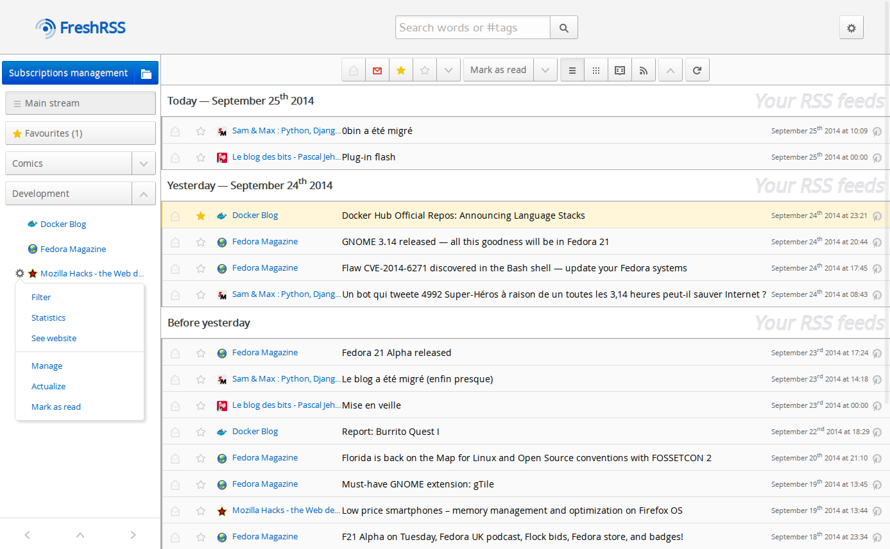

[](https://travis-ci.org/FreshRSS/FreshRSS)
[](https://liberapay.com/FreshRSS/donate)

* Lire ce document sur [github.com/FreshRSS/FreshRSS/](https://github.com/FreshRSS/FreshRSS/blob/master/README.md) pour avoir les images et liens corrects.
* [English version](README.md)

# FreshRSS
FreshRSS est un agrégateur de flux RSS à auto-héberger à l’image de [Leed](https://github.com/LeedRSS/Leed) ou de [Kriss Feed](https://tontof.net/kriss/feed/).

Il se veut léger et facile à prendre en main tout en étant un outil puissant et paramétrable.

Il permet de gérer plusieurs utilisateurs, dispose d’un mode de lecture anonyme, et supporte les étiquettes personnalisées.
Il y a une API pour les clients (mobiles), ainsi qu’une [interface en ligne de commande](cli/README.md).

Grâce au standard [WebSub](https://www.w3.org/TR/websub/) (anciennement [PubSubHubbub](https://github.com/pubsubhubbub/PubSubHubbub)),
FreshRSS est capable de recevoir des notifications push instantanées depuis les sources compatibles, telles [Mastodon](https://joinmastodon.org), [Friendica](https://friendi.ca), [WordPress](https://wordpress.org/plugins/pubsubhubbub/), Blogger, FeedBurner, etc.

Enfin, il permet l’ajout d’[extensions](#extensions) pour encore plus de personnalisation.

Les demandes de fonctionnalités, rapports de bugs, et autres contributions sont les bienvenues. Privilégiez pour cela des [demandes sur GitHub](https://github.com/FreshRSS/FreshRSS/issues).
Nous sommes une communauté amicale.

* Site officiel : https://freshrss.org
* Démo : http://demo.freshrss.org/
* Licence : [GNU AGPL 3](https://www.gnu.org/licenses/agpl-3.0.fr.html)


# Avertissements
FreshRSS n’est fourni avec aucune garantie.



# [Documentation](https://freshrss.github.io/FreshRSS/fr/)
* La [documentation utilisateurs](https://freshrss.github.io/FreshRSS/fr/users/02_First_steps.html) pour découvrir les fonctionnalités de FreshRSS.
* La [documentation administrateurs](https://freshrss.github.io/FreshRSS/fr/users/01_Installation.html) pour l’installation et la maintenance de FreshRSS.
* La [documentation développeurs](https://freshrss.github.io/FreshRSS/fr/developers/01_First_steps.html) pour savoir comment contribuer et mieux comprendre le code source de FreshRSS.
* Le [guide de contribution](https://freshrss.github.io/FreshRSS/fr/contributing.html) pour nous aider à développer FreshRSS.

# Prérequis
* Un navigateur Web récent tel que Firefox / IceCat, Internet Explorer 11 / Edge (sauf certains détails), Chromium / Chrome, Opera, Safari.
	* Fonctionne aussi sur mobile (sauf certaines fonctionnalités)
* Serveur modeste, par exemple sous Linux ou Windows
	* Fonctionne même sur un Raspberry Pi 1 avec des temps de réponse < 1s (testé sur 150 flux, 22k articles)
* Serveur Web Apache2 (recommandé), ou nginx, lighttpd (non testé sur les autres)
* PHP 5.6+ (PHP 7+ recommandé pour de meilleures performances)
	* Requis : [cURL](https://www.php.net/curl), [DOM](https://www.php.net/dom), [JSON](https://www.php.net/json), [XML](https://www.php.net/xml), [session](https://www.php.net/session), [ctype](https://www.php.net/ctype), et [PDO_MySQL](https://www.php.net/pdo-mysql) ou [PDO_SQLite](https://www.php.net/pdo-sqlite) ou [PDO_PGSQL](https://www.php.net/pdo-pgsql)
	* Recommandés : [GMP](https://www.php.net/gmp) (pour accès API sur plateformes < 64 bits), [IDN](https://www.php.net/intl.idn) (pour les noms de domaines internationalisés), [mbstring](https://www.php.net/mbstring) (pour le texte Unicode), [iconv](https://www.php.net/iconv) (pour conversion d’encodages), [ZIP](https://www.php.net/zip) (pour import/export), [zlib](https://www.php.net/zlib) (pour les flux compressés)
* MySQL 5.5.3+ ou équivalent MariaDB, ou SQLite 3.7.4+, ou PostgreSQL 9.5+


# Téléchargement
Voir la [liste des versions](../../releases).

## À propos des branches
* Utilisez [la branche master](https://github.com/FreshRSS/FreshRSS/tree/master/) si vous souhaitez des versions moins fréquentes et stables.
* Utilisez [la branche dev](https://github.com/FreshRSS/FreshRSS/tree/dev) si vous vouler une publication continue (rolling release) avec les dernières nouveautés, ou bien aider à tester ou développer la future version stable.


# [Installation](https://freshrss.github.io/FreshRSS/fr/users/01_Installation.html)

## Installation automatisée
* [](./Docker/)
* [](https://install-app.yunohost.org/?app=freshrss)
* [](https://cloudron.io/button.html?app=org.freshrss.cloudronapp)

## Installation manuelle
1. Récupérez l’application FreshRSS via la commande git ou [en téléchargeant l’archive](../releases)
2. Placez l’application sur votre serveur (la partie à exposer au Web est le répertoire `./p/`)
3. Le serveur Web doit avoir les droits d’écriture dans le répertoire `./data/`
4. Accédez à FreshRSS à travers votre navigateur Web et suivez les instructions d’installation
	* ou utilisez [l’interface en ligne de commande](cli/README.md)
5. Tout devrait fonctionner :) En cas de problème, n’hésitez pas à [nous contacter](https://github.com/FreshRSS/FreshRSS/issues).
6. Des paramètres de configuration avancés peuvent être vus dans [config.default.php](config.default.php) et modifiés dans `data/config.php`.
7. Avec Apache, activer [`AllowEncodedSlashes`](https://httpd.apache.org/docs/trunk/mod/core.html#allowencodedslashes) pour une meilleure compatibilité avec les clients mobiles.

Plus d’informations sur l’installation et la configuration serveur peuvent être trouvées dans [notre documentation](https://freshrss.github.io/FreshRSS/fr/users/01_Installation.html).

### Exemple d’installation complète sur Linux Debian/Ubuntu
```sh
# Si vous utilisez le serveur Web Apache (sinon il faut un autre serveur Web)
sudo apt-get install apache2
sudo a2enmod headers expires rewrite ssl	#Modules Apache

# Exemple pour Ubuntu >= 16.04, Debian >= 9 Stretch
sudo apt install php php-curl php-gmp php-intl php-mbstring php-sqlite3 php-xml php-zip
sudo apt install libapache2-mod-php	#Pour Apache
sudo apt install mysql-server mysql-client php-mysql	#Base de données MySQL optionnelle
sudo apt install postgresql php-pgsql	#Base de données PostgreSQL optionnelle

## Redémarrage du serveur Web
sudo service apache2 restart

# Pour FreshRSS lui-même (git est optionnel si vous déployez manuellement les fichiers d’installation)
cd /usr/share/
sudo apt-get install git
sudo git clone https://github.com/FreshRSS/FreshRSS.git
cd FreshRSS

# Si vous souhaitez utiliser la branche développement de FreshRSS
sudo git checkout -b dev origin/dev

# Mettre les droits d’accès pour le serveur Web
sudo chown -R :www-data . && sudo chmod -R g+r . && sudo chmod -R g+w ./data/
# Si vous souhaitez permettre les mises à jour par l’interface Web
sudo chmod -R g+w .

# Publier FreshRSS dans votre répertoire HTML public
sudo ln -s /usr/share/FreshRSS/p /var/www/html/FreshRSS
# Naviguez vers http://example.net/FreshRSS pour terminer l’installation
# (Si vous le faite depuis localhost, vous pourrez avoir à ajuster le réglage de votre adresse publique)
# ou utilisez l’interface en ligne de commande

# Mettre à jour FreshRSS vers une nouvelle version par git
cd /usr/share/FreshRSS
sudo git pull
sudo chown -R :www-data . && sudo chmod -R g+r . && sudo chmod -R g+w ./data/
```

Voir la [documentation de la ligne de commande](cli/README.md) pour plus de détails.

## Contrôle d’accès
Il est requis pour le mode multi-utilisateur, et recommandé dans tous les cas, de limiter l’accès à votre FreshRSS. Au choix :
* En utilisant l’identification par formulaire (requiert JavaScript)
* En utilisant un contrôle d’accès HTTP défini par votre serveur Web
	* Voir par exemple la [documentation d’Apache sur l’authentification](https://httpd.apache.org/docs/trunk/howto/auth.html)
		* Créer dans ce cas un fichier `./p/i/.htaccess` avec un fichier `.htpasswd` correspondant.

# Rafraîchissement automatique des flux
* Vous pouvez ajouter une tâche Cron lançant régulièrement le script d’actualisation automatique des flux.
Consultez la documentation de Cron de votre système d’exploitation ([Debian/Ubuntu](https://doc.ubuntu-fr.org/cron), [Red Hat/Fedora](https://doc.fedora-fr.org/wiki/CRON_:_Configuration_de_t%C3%A2ches_automatis%C3%A9es), [Slackware](https://docs.slackware.com/fr:slackbook:process_control?#cron), [Gentoo](https://wiki.gentoo.org/wiki/Cron/fr), [Arch Linux](https://wiki.archlinux.fr/Cron)…).
C’est une bonne idée d’utiliser le même utilisateur que votre serveur Web (souvent “www-data”).
Par exemple, pour exécuter le script toutes les heures :

```
8 * * * * php /usr/share/FreshRSS/app/actualize_script.php > /tmp/FreshRSS.log 2>&1
```

### Exemple pour Debian / Ubuntu
Créer `/etc/cron.d/FreshRSS` avec :

```
7,37 * * * * www-data php -f /usr/share/FreshRSS/app/actualize_script.php > /tmp/FreshRSS.log 2>&1
```

## Conseils
* Pour une meilleure sécurité, faites en sorte que seul le répertoire `./p/` soit accessible depuis le Web, par exemple en faisant pointer un sous-domaine sur le répertoire `./p/`.
	* En particulier, les données personnelles se trouvent dans le répertoire `./data/`.
* Le fichier `./constants.php` définit les chemins d’accès aux répertoires clés de l’application. Si vous les bougez, tout se passe ici.
* En cas de problème, les logs peuvent être utile à lire, soit depuis l’interface de FreshRSS, soit manuellement depuis `./data/users/*/log*.txt`.
	* Le répertoire spécial `./data/users/_/` contient la partie des logs partagés par tous les utilisateurs.


# F.A.Q. :
* La date et l’heure dans la colonne de droite sont celles déclarées par le flux, pas l’heure à laquelle les articles ont été reçus par FreshRSS, et cette colonne n’est pas utilisée pour le tri.
	* En particulier, lors de l’import d’un nouveau flux, ses articles sont importés en tête de liste.


# Sauvegarde
* Il faut conserver vos fichiers `./data/config.php` ainsi que `./data/users/*/config.php`
* Vous pouvez exporter votre liste de flux au format OPML soit depuis l’interface Web, soit [en ligne de commande](cli/README.md)
* Pour sauvegarder les articles eux-mêmes, vous pouvez utiliser [phpMyAdmin](https://www.phpmyadmin.net) ou les outils de MySQL :

```bash
mysqldump --skip-comments --disable-keys --user=<db_user> --password --host <db_host> --result-file=freshrss.dump.sql --databases <freshrss_db>
```


# Extensions
FreshRSS permet l’ajout d’extensions en plus des fonctionnalités natives.
Voir le [dépôt dédié à ces extensions](https://github.com/FreshRSS/Extensions).


# APIs et applications natives

FreshRSS supporte l’accès depuis des applications natives pour Linux, Android, iOS, et OS X, grâce à deux APIs distinctes.

## Via l’API compatible Google Reader

Voir notre [documentation sur l’accès mobile](https://freshrss.github.io/FreshRSS/fr/users/06_Mobile_access.html).

Tout client supportant une API de type Google Reader ; Sélection :

* Android
	* [News+](https://play.google.com/store/apps/details?id=com.noinnion.android.newsplus) avec [News+ Google Reader extension](https://play.google.com/store/apps/details?id=com.noinnion.android.newsplus.extension.google_reader) (Propriétaire)
	* [FeedMe 3.5.3+](https://play.google.com/store/apps/details?id=com.seazon.feedme) (Propriétaire)
	* [EasyRSS](https://github.com/Alkarex/EasyRSS) (Libre, [F-Droid](https://f-droid.org/fr/packages/org.freshrss.easyrss/))
* GNU/Linux
	* [FeedReader 2.0+](https://jangernert.github.io/FeedReader/) (Libre)
* iOS
	* [Reeder](https://www.reederapp.com/) (Commercial)
* MacOS
	* [Vienna RSS](http://www.vienna-rss.com/) (Libre)
	* [Reeder](https://www.reederapp.com/) (Commercial)

## Via l’API compatible Fever

Voir notre [documentation sur l’API Fever](https://freshrss.github.io/FreshRSS/fr/users/06_Fever_API.html) page.

Tout client supportant une API de type Fever ; Sélection :

* Android
	* [Readably](https://play.google.com/store/apps/details?id=com.isaiasmatewos.readably) (Propriétaire)
* iOS
	* [Fiery Feeds](https://apps.apple.com/app/fiery-feeds-rss-reader/id1158763303) (Propriétaire)
	* [Unread](https://apps.apple.com/app/unread-rss-reader/id1252376153) (Commercial)
* MacOS
	* [Readkit](https://apps.apple.com/app/readkit/id588726889) (Commercial)


# Bibliothèques incluses
* [SimplePie](https://simplepie.org/)
* [MINZ](https://github.com/marienfressinaud/MINZ)
* [php-http-304](https://alexandre.alapetite.fr/doc-alex/php-http-304/)
* [jQuery](https://jquery.com/)
* [lib_opml](https://github.com/marienfressinaud/lib_opml)
* [flotr2](http://www.humblesoftware.com/flotr2)
* [PHPMailer](https://github.com/PHPMailer/PHPMailer)

## Uniquement pour certaines options ou configurations
* [bcrypt.js](https://github.com/dcodeIO/bcrypt.js)
* [phpQuery](https://github.com/phpquery/phpquery)


