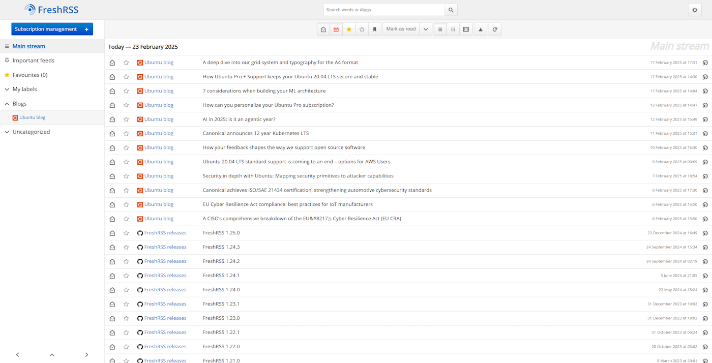

* 请在 [github.com/FreshRSS/FreshRSS/](https://github.com/FreshRSS/FreshRSS/blob/edge/README.zh-CN.md) 阅读此文档以加载正确的链接与图片
* [English version](README.md) • [Version française](README.fr.md)

# FreshRSS

FreshRSS 是一款可自行部署的 RSS 聚合阅读器。

它轻量、易用、功能强大、可高度自定义，并已被[翻译](#国际化)成多种语言。

FreshRSS 支持多用户使用，并提供匿名阅读模式；支持自定义标签；同时提供供（移动）客户端使用的 API 以及命令行接口（[CLI](cli/README.md)）。

借助 [WebSub](https://freshrss.github.io/FreshRSS/en/users/WebSub.html) 标准，FreshRSS 能够即时接收来自兼容源（如 [Friendica](https://friendi.ca)、[WordPress](https://wordpress.org/plugins/pubsubhubbub/)、Blogger、Medium 等）的推送更新。

FreshRSS 原生支持基于 [XPath](https://www.w3.org/TR/xpath-10/) 的基础[网页抓取](https://freshrss.github.io/FreshRSS/en/users/11_website_scraping.html)，可用于无 RSS / Atom 订阅源的网站，并且也支持 JSON 格式的文档。

它还允许用户[通过 HTML、RSS 或 OPML 的形式分享自己筛选的文章集](https://freshrss.github.io/FreshRSS/en/users/user_queries.html)。

FreshRSS 支持[多种登录方式](https://freshrss.github.io/FreshRSS/en/admins/09_AccessControl.html)：网页表单（含匿名选项）、HTTP 认证（可与代理授权兼容）、以及 OpenID Connect。

此外，FreshRSS 还支持安装[扩展](#扩展功能)以进一步定制功能。

* 官方网站：<https://freshrss.org>
* 演示网站：<https://demo.freshrss.org>
* 许可授权：[GNU AGPL 3](https://www.gnu.org/licenses/agpl-3.0.html)

## 反馈与贡献

欢迎提交功能建议、错误报告及其他形式的贡献。最好的方式是在 GitHub 上[开启一个 issue](https://github.com/FreshRSS/FreshRSS/issues)。我们是一个友好开放的社区。

为方便贡献者，FreshRSS 提供了[以下协作途径](.devcontainer/README.md)：

## 演示截图

## 免责声明

FreshRSS 不提供任何形式的担保。

# [文档](https://freshrss.github.io/FreshRSS/en/)

* [用户文档](https://freshrss.github.io/FreshRSS/en/users/02_First_steps.html)：了解 FreshRSS 所提供的全部功能
* [管理员文档](https://freshrss.github.io/FreshRSS/en/admins/01_Index.html)：涵盖安装与维护的详细操作说明
* [开发者文档](https://freshrss.github.io/FreshRSS/en/developers/01_Index.html)：帮助熟悉 FreshRSS 源代码结构，指导开发或贡献
* [贡献者指南](https://freshrss.github.io/FreshRSS/en/contributing.html)：为希望改进 FreshRSS 的开发者提供协作规范

# 系统要求

* 浏览器：Firefox / IceCat、Edge、Chromium / Chrome、Opera、Safari 等现代浏览器
	* 支持移动端访问，但部分功能可能受限
* 服务器：轻量级 Linux 或 Windows 服务器
	* 实测 Raspberry Pi 1 上运行 150 个订阅源、2.2 万篇文章时，响应时间仍可低于 1 秒
* Web 服务器：推荐 Apache 2.4+，也兼容 nginx、lighttpd（其他未测试）
* PHP 版本：8.1 及以上
	* 必需扩展：[cURL](https://www.php.net/curl)、[DOM](https://www.php.net/dom)、[JSON](https://www.php.net/json)、[XML](https://www.php.net/xml)、[session](https://www.php.net/session)、[ctype](https://www.php.net/ctype)
	* 推荐扩展：
		* [PDO_SQLite](https://www.php.net/pdo-sqlite)（用于数据库导入/导出）
		* [GMP](https://www.php.net/gmp)（用于 32 位平台的 API）
		* [IDN](https://www.php.net/intl.idn)（支持国际化域名）
		* [mbstring](https://www.php.net/mbstring)（处理 Unicode 字符串）
		* [iconv](https://www.php.net/iconv)（字符集转换）
		* [ZIP](https://www.php.net/zip)（用于文件导入/导出）
		* [zlib](https://www.php.net/zlib)（处理压缩的订阅源）
	* 数据库扩展：[PDO_PGSQL](https://www.php.net/pdo-pgsql) 或 [PDO_SQLite](https://www.php.net/pdo-sqlite) 亦或 [PDO_MySQL](https://www.php.net/pdo-mysql)
* 数据库版本：PostgreSQL 10+、SQLite、MariaDB 10.0.5+ 或 MySQL 8.0+

# [安装](https://freshrss.github.io/FreshRSS/en/admins/03_Installation.html)

最新的稳定版本可在 [GitHub](https://github.com/FreshRSS/FreshRSS/releases/latest) 上获取，通常每两到三个月会发布一个新版本。

若您希望体验最新功能，或参与下一版稳定版本的测试与开发，可使用 [edge 分支](https://github.com/FreshRSS/FreshRSS/tree/edge/)。

## 自动安装

* 
* 
* 
* 
* 
* 
* 
* 

## 手动安装

1. 通过 git 获取 FreshRSS，或[下载压缩包](https://github.com/FreshRSS/FreshRSS/archive/latest.zip)
2. 将应用放置在服务器上的任意位置（仅将 `./p/` 文件夹暴露给 Web 访问）
3. 为 Web 服务器用户授予对 `./data/` 文件夹的写入权限
4. 使用浏览器访问 FreshRSS 并按照安装引导进行配置
	* 或通过命令行界面（[CLI](cli/README.md)）完成安装
5. 一切就绪后即可正常运行 :) 若遇到问题，欢迎[联系我们](https://github.com/FreshRSS/FreshRSS/issues)
6. 高级配置项可在 [config.default.php](config.default.php) 中查看，并可在 `data/config.php` 中修改
7. 若使用 Apache，建议启用 [`AllowEncodedSlashes`](https://httpd.apache.org/docs/trunk/mod/core.html#allowencodedslashes)  以提高移动端兼容性

有关安装与服务器配置的详细信息，请参阅我们的[官方文档](https://freshrss.github.io/FreshRSS/en/admins/03_Installation.html)。

# 建议

* 为了安全起见，仅将 `./p/` 文件夹暴露给 Web
	* 请注意，`./data/` 文件夹中包含所有个人数据，切勿公开
* `./constants.php` 文件定义了应用文件夹的访问路径，若需自定义安装，请先查阅此文件
* 若遇到问题，可在界面中查看日志，或手动查看 `./data/users/*/log*.txt` 文件
	* 特殊文件夹 `./data/users/_/` 存放了所有用户共享的日志部分

# 常见问题（FAQ）

* 右侧栏显示的日期时间为订阅源声明的日期，而非 FreshRSS 接收到文章的时间，也不会作为排序依据
	* 特别地，当导入新的订阅源时，其所有文章将显示在订阅列表顶部，而不论其发布时间先后

# 扩展功能

FreshRSS 支持通过添加扩展来进一步自定义核心功能。请参阅[专门的扩展仓库](https://github.com/FreshRSS/Extensions)以了解更多信息。

# 国际化

FreshRSS 支持 20 余种语言，以下是各自的翻译进度，欢迎参与贡献！

<translations>
<!-- This section is automatically generated by `./cli/check.translation.php -g` -->

| 语言 | 进度 | |
| - | - | - |
| Čeština (cs) | ￭￭￭￭￭￭￭￭･･ 88% | [贡献翻译](https://github.com/search?q=repo%3AFreshRSS%2FFreshRSS+path%3Aapp%2Fi18n%2Fcs+%2F%28TODO%7CDIRTY%29%24%2F) |
| Deutsch (de) | ￭￭￭￭￭￭￭￭￭･ 99% | [贡献翻译](https://github.com/search?q=repo%3AFreshRSS%2FFreshRSS+path%3Aapp%2Fi18n%2Fde+%2F%28TODO%7CDIRTY%29%24%2F) |
| Ελληνικά (el) | ￭￭････････ 22% | [贡献翻译](https://github.com/search?q=repo%3AFreshRSS%2FFreshRSS+path%3Aapp%2Fi18n%2Fel+%2F%28TODO%7CDIRTY%29%24%2F) |
| English (en) | ￭￭￭￭￭￭￭￭￭￭ 100% | [贡献翻译](https://github.com/search?q=repo%3AFreshRSS%2FFreshRSS+path%3Aapp%2Fi18n%2Fen+%2F%28TODO%7CDIRTY%29%24%2F) |
| English (United States) (en-US) | ￭￭￭￭￭￭￭￭￭￭ 100% | [贡献翻译](https://github.com/search?q=repo%3AFreshRSS%2FFreshRSS+path%3Aapp%2Fi18n%2Fen-US+%2F%28TODO%7CDIRTY%29%24%2F) |
| Español (es) | ￭￭￭￭￭￭￭￭￭･ 91% | [贡献翻译](https://github.com/search?q=repo%3AFreshRSS%2FFreshRSS+path%3Aapp%2Fi18n%2Fes+%2F%28TODO%7CDIRTY%29%24%2F) |
| فارسی (fa) | ￭￭￭￭￭￭￭￭￭･ 97% | [贡献翻译](https://github.com/search?q=repo%3AFreshRSS%2FFreshRSS+path%3Aapp%2Fi18n%2Ffa+%2F%28TODO%7CDIRTY%29%24%2F) |
| Suomi (fi) | ￭￭￭￭￭￭￭￭￭￭ 100% | [贡献翻译](https://github.com/search?q=repo%3AFreshRSS%2FFreshRSS+path%3Aapp%2Fi18n%2Ffi+%2F%28TODO%7CDIRTY%29%24%2F) |
| Français (fr) | ￭￭￭￭￭￭￭￭￭￭ 100% | [贡献翻译](https://github.com/search?q=repo%3AFreshRSS%2FFreshRSS+path%3Aapp%2Fi18n%2Ffr+%2F%28TODO%7CDIRTY%29%24%2F) |
| עברית (he) | ￭￭￭￭･･････ 45% | [贡献翻译](https://github.com/search?q=repo%3AFreshRSS%2FFreshRSS+path%3Aapp%2Fi18n%2Fhe+%2F%28TODO%7CDIRTY%29%24%2F) |
| Magyar (hu) | ￭￭￭￭￭￭￭￭￭･ 99% | [贡献翻译](https://github.com/search?q=repo%3AFreshRSS%2FFreshRSS+path%3Aapp%2Fi18n%2Fhu+%2F%28TODO%7CDIRTY%29%24%2F) |
| Bahasa Indonesia (id) | ￭￭￭￭￭￭￭￭￭･ 96% | [贡献翻译](https://github.com/search?q=repo%3AFreshRSS%2FFreshRSS+path%3Aapp%2Fi18n%2Fid+%2F%28TODO%7CDIRTY%29%24%2F) |
| Italiano (it) | ￭￭￭￭￭￭￭￭￭･ 96% | [贡献翻译](https://github.com/search?q=repo%3AFreshRSS%2FFreshRSS+path%3Aapp%2Fi18n%2Fit+%2F%28TODO%7CDIRTY%29%24%2F) |
| 日本語 (ja) | ￭￭￭￭￭￭￭￭￭･ 95% | [贡献翻译](https://github.com/search?q=repo%3AFreshRSS%2FFreshRSS+path%3Aapp%2Fi18n%2Fja+%2F%28TODO%7CDIRTY%29%24%2F) |
| 한국어 (ko) | ￭￭￭￭￭￭￭￭･･ 88% | [贡献翻译](https://github.com/search?q=repo%3AFreshRSS%2FFreshRSS+path%3Aapp%2Fi18n%2Fko+%2F%28TODO%7CDIRTY%29%24%2F) |
| Latviešu (lv) | ￭￭￭￭￭￭￭￭･･ 82% | [贡献翻译](https://github.com/search?q=repo%3AFreshRSS%2FFreshRSS+path%3Aapp%2Fi18n%2Flv+%2F%28TODO%7CDIRTY%29%24%2F) |
| Nederlands (nl) | ￭￭￭￭￭￭￭￭￭･ 99% | [贡献翻译](https://github.com/search?q=repo%3AFreshRSS%2FFreshRSS+path%3Aapp%2Fi18n%2Fnl+%2F%28TODO%7CDIRTY%29%24%2F) |
| Occitan (oc) | ￭￭￭￭￭￭￭￭･･ 81% | [贡献翻译](https://github.com/search?q=repo%3AFreshRSS%2FFreshRSS+path%3Aapp%2Fi18n%2Foc+%2F%28TODO%7CDIRTY%29%24%2F) |
| Polski (pl) | ￭￭￭￭￭￭￭￭￭￭ 100% | [贡献翻译](https://github.com/search?q=repo%3AFreshRSS%2FFreshRSS+path%3Aapp%2Fi18n%2Fpl+%2F%28TODO%7CDIRTY%29%24%2F) |
| Português (Brasil) (pt-BR) | ￭￭￭￭￭￭￭￭･･ 88% | [贡献翻译](https://github.com/search?q=repo%3AFreshRSS%2FFreshRSS+path%3Aapp%2Fi18n%2Fpt-BR+%2F%28TODO%7CDIRTY%29%24%2F) |
| Português (Portugal) (pt-PT) | ￭￭￭￭￭￭￭￭･･ 87% | [贡献翻译](https://github.com/search?q=repo%3AFreshRSS%2FFreshRSS+path%3Aapp%2Fi18n%2Fpt-PT+%2F%28TODO%7CDIRTY%29%24%2F) |
| Русский (ru) | ￭￭￭￭￭￭￭￭･･ 88% | [贡献翻译](https://github.com/search?q=repo%3AFreshRSS%2FFreshRSS+path%3Aapp%2Fi18n%2Fru+%2F%28TODO%7CDIRTY%29%24%2F) |
| Slovenčina (sk) | ￭￭￭￭￭￭￭￭･･ 88% | [贡献翻译](https://github.com/search?q=repo%3AFreshRSS%2FFreshRSS+path%3Aapp%2Fi18n%2Fsk+%2F%28TODO%7CDIRTY%29%24%2F) |
| Türkçe (tr) | ￭￭￭￭￭￭￭￭￭･ 96% | [贡献翻译](https://github.com/search?q=repo%3AFreshRSS%2FFreshRSS+path%3Aapp%2Fi18n%2Ftr+%2F%28TODO%7CDIRTY%29%24%2F) |
| Українська (uk) | ￭￭￭￭￭￭￭￭￭･ 99% | [贡献翻译](https://github.com/search?q=repo%3AFreshRSS%2FFreshRSS+path%3Aapp%2Fi18n%2Fuk+%2F%28TODO%7CDIRTY%29%24%2F) |
| 简体中文 (zh-CN) | ￭￭￭￭￭￭￭￭￭･ 90% | [贡献翻译](https://github.com/search?q=repo%3AFreshRSS%2FFreshRSS+path%3Aapp%2Fi18n%2Fzh-CN+%2F%28TODO%7CDIRTY%29%24%2F) |
| 正體中文 (zh-TW) | ￭￭￭￭￭￭￭￭･･ 88% | [贡献翻译](https://github.com/search?q=repo%3AFreshRSS%2FFreshRSS+path%3Aapp%2Fi18n%2Fzh-TW+%2F%28TODO%7CDIRTY%29%24%2F) |

</translations>

# API 与原生应用

FreshRSS 支持通过两种不同的 API 供 Linux、Android、iOS、Windows 和 macOS 的移动或原生应用访问：

* [Google Reader API](https://freshrss.github.io/FreshRSS/en/developers/06_GoogleReader_API.html)（推荐，最佳）
* [Fever API](https://freshrss.github.io/FreshRSS/en/developers/06_Fever_API.html)（功能有限、效率较低、安全性较差）

| 应用 | 操作 系统 | 自由 软件 | 维护与开发 状态 | API | 离线阅读 | 同步速度 | 单独视图中 加载更多 | 获取 已读文章 | 收藏夹 | 标签 | 播客 | 管理 订阅源 |
|:--------------------------------------------------------------------------------------|:-----------:|:-------------------------------------------------------------:|:----------------------:|:----------------:|:-------------:|:---------:|:------------------------------:|:-------------------:|:----------:|:------:|:--------:|:------------:|
| [Readrops](https://github.com/readrops/Readrops)                                      | Android     | &nbsp;&nbsp;[✔️](https://github.com/readrops/Readrops)&nbsp;&nbsp; | &nbsp;&nbsp;&nbsp;&nbsp;&nbsp;✔️✔️&nbsp;&nbsp;&nbsp;&nbsp;&nbsp; | GReader          | &nbsp;&nbsp;✔️&nbsp;&nbsp; | ⭐⭐⭐    | &nbsp;&nbsp;&nbsp;&nbsp;&nbsp;&nbsp;&nbsp;➖&nbsp;&nbsp;&nbsp;&nbsp;&nbsp;&nbsp;&nbsp; |&nbsp;&nbsp;&nbsp;&nbsp;&nbsp;✔️&nbsp;&nbsp;&nbsp;&nbsp;&nbsp; | &nbsp;&nbsp;&nbsp;✔️&nbsp;&nbsp;&nbsp; | &nbsp;&nbsp;[➖](https://github.com/readrops/Readrops/issues/54)&nbsp;&nbsp; | &nbsp;&nbsp;➖&nbsp;&nbsp; | &nbsp;&nbsp;&nbsp;✔️&nbsp;&nbsp;&nbsp;           |
| [Capy Reader](https://github.com/jocmp/capyreader)                                    | Android     | [✔️](https://github.com/jocmp/capyreader)                     | ✔️✔️                   | GReader          | ✔️            | ⭐⭐      | [➖](https://github.com/jocmp/capyreader/discussions/532) | ➖                  | ✔️         | [➖](https://github.com/jocmp/capyreader/discussions/531) | ➖       | ✔️           |
| [FeedMe](https://play.google.com/store/apps/details?id=com.seazon.feedme)             | Android     | [➖](https://github.com/seazon/FeedMe)                        | ✔️✔️                   | GReader          | ✔️            | ⭐⭐       | ➖                             | ➖                  | ✔️         | [✔️](https://github.com/seazon/FeedMe/issues/348) | ✔️       | ✔️           |
| [FocusReader](https://play.google.com/store/apps/details?id=allen.town.focus.reader)  | Android     | ➖                                                            | ✔️✔️                   | GReader          | ✔️            | ⭐⭐       | ➖                             | ➖                  | ✔️         | ✔️     | ✔️       | ✔️           |
| [Your News](https://yournews.app/)                                                    | Android, iOS| ➖                                                            | ✔️✔️                   | GReader          | ➖️            | ⭐        | ✔️                             | ✔️                  | ✔️        | ➖     | ➖      | ➖        |
| [Fluent Reader Lite](https://hyliu.me/fluent-reader-lite/)                            | Android, iOS| [✔️](https://github.com/yang991178/fluent-reader-lite)        | ✔️                     | GReader          | ✔️            | ⭐⭐       | ➖                             | ➖                  | ✔️         | ➖     | ➖       | ➖           |
| [Read You](https://github.com/Ashinch/ReadYou/)                                       | Android     | [✔️](https://github.com/Ashinch/ReadYou/)                     | [完善中](https://github.com/Ashinch/ReadYou/discussions/542) | GReader | ➖            | [⭐](https://github.com/Ashinch/ReadYou/issues/666) | ➖                    | ✔️                   | ✔️             | ➖     | ➖       | ✔️           |

| 应用 | 操作 系统 | 自由 软件 | 维护与开发状态 | API | 离线阅读 | 同步速度 | 单独视图中 加载更多 | 获取 已读文章 | 收藏夹 | 标签 | 播客 | 管理 订阅源 |
|:--------------------------------------------------------------------------------------|:-----------:|:-------------------------------------------------------------:|:----------------------:|:----------------:|:-------------:|:---------:|:------------------------------:|:-------------------:|:----------:|:------:|:--------:|:------------:|
| [Fluent Reader](https://hyliu.me/fluent-reader/)                             | Windows, Linux, macOS| &nbsp;&nbsp;[✔️](https://github.com/yang991178/fluent-reader)&nbsp;&nbsp;             | &nbsp;&nbsp;&nbsp;&nbsp;&nbsp;✔️✔️&nbsp;&nbsp;&nbsp;&nbsp;&nbsp; | GReader          | &nbsp;&nbsp;✔️&nbsp;&nbsp;            | &nbsp;&nbsp;&nbsp;&nbsp;&nbsp;⭐&nbsp;&nbsp;&nbsp;&nbsp;&nbsp; | &nbsp;&nbsp;&nbsp;&nbsp;&nbsp;&nbsp;&nbsp;➖&nbsp;&nbsp;&nbsp;&nbsp;&nbsp;&nbsp;&nbsp; | &nbsp;&nbsp;&nbsp;&nbsp;&nbsp;✔️&nbsp;&nbsp;&nbsp;&nbsp;&nbsp; | &nbsp;&nbsp;&nbsp;&nbsp;✔️&nbsp;&nbsp;&nbsp;&nbsp;         | &nbsp;&nbsp;➖&nbsp;&nbsp;     | &nbsp;&nbsp;➖&nbsp;&nbsp; | &nbsp;&nbsp;&nbsp;➖&nbsp;&nbsp;&nbsp; |
| [RSS Guard](https://github.com/martinrotter/rssguard)             | Windows, GNU/Linux, macOS, OS/2 | [✔️](https://github.com/martinrotter/rssguard)                | ✔️✔️                   | GReader          | ✔️            | ⭐⭐      | ➖ | ✔️ | ✔️ | ✔️ | ✔️ | ✔️ |
| [NewsFlash](https://gitlab.com/news-flash/news_flash_gtk)                             | GNU/Linux   | [✔️](https://gitlab.com/news-flash/news_flash_gtk)            | ✔️✔️                   | GReader          | ➖            | ⭐⭐      | ➖                           | ✔️                | ✔️       | ✔️    | ➖      | ➖          |
| [Newsboat](https://newsboat.org/)                                       | GNU/Linux, macOS, FreeBSD | [✔️](https://github.com/newsboat/newsboat/)                   | ✔️✔️                   | GReader          | ➖            | ⭐        | ➖                             | ✔️                  | ✔️         | ➖     | ✔️       | ➖           |

| 应用 | 操作 系统 | 自由 软件 | 维护与开发状态 | API | 离线阅读 | 同步速度 | 单独视图中 加载更多 | 获取 已读文章 | 收藏夹 | 标签 | 播客 | 管理 订阅源 |
|:--------------------------------------------------------------------------------------|:-----------:|:-------------------------------------------------------------:|:----------------------:|:----------------:|:-------------:|:---------:|:------------------------------:|:-------------------:|:----------:|:------:|:--------:|:------------:|
| [Vienna RSS](http://www.vienna-rss.com/)                                              | macOS       | &nbsp;&nbsp;[✔️](https://github.com/ViennaRSS/vienna-rss)&nbsp;&nbsp;                 | &nbsp;&nbsp;&nbsp;&nbsp;&nbsp;✔️✔️&nbsp;&nbsp;&nbsp;&nbsp;&nbsp; | GReader          | &nbsp;&nbsp;❔&nbsp;&nbsp; | ❔        | &nbsp;&nbsp;&nbsp;&nbsp;&nbsp;&nbsp;&nbsp;&nbsp;❔&nbsp;&nbsp;&nbsp;&nbsp;&nbsp;&nbsp;&nbsp;&nbsp; | &nbsp;&nbsp;&nbsp;&nbsp;&nbsp;&nbsp;&nbsp;❔&nbsp;&nbsp;&nbsp;&nbsp;&nbsp;&nbsp; | &nbsp;&nbsp;&nbsp;&nbsp;❔&nbsp;&nbsp;&nbsp;&nbsp;         | &nbsp;&nbsp;❔&nbsp;&nbsp; | &nbsp;&nbsp;❔&nbsp;&nbsp; | &nbsp;&nbsp;&nbsp;&nbsp;❔&nbsp;&nbsp;&nbsp;&nbsp; |
| [Readkit](https://apps.apple.com/app/readkit-read-later-rss/id1615798039)             | iOS, macOS  | ➖                                                            | ✔️✔️                   | GReader          | ✔️            | ⭐⭐⭐    | ➖                             | ✔️                  | ✔️         | ➖     | ✔️       | 💲           |
| [Reeder Classic](https://www.reederapp.com/classic/)                                 | iOS, macOS  | ➖                                                            | ✔️✔️                   | GReader          | ✔️            | ⭐⭐⭐    | ➖                             | ✔️                  | ✔️         | ➖     | ➖       | ✔️           |
| [lire](https://lireapp.com/)                                                          | iOS, macOS  | ➖                                                            | ✔️✔️                   | GReader          | ❔            | ❔        | ❔                             | ❔                  | ❔         | ❔     | ❔       | ❔           |
| [Unread](https://apps.apple.com/app/unread-2/id1363637349)                            | iOS         | ➖                                                            | ✔️✔️                   | Fever            | ✔️            | ❔        | ❔                             | ❔                  | ✔️         | ➖     | ➖       | ➖           |
| [Fiery Feeds](https://apps.apple.com/app/fiery-feeds-rss-reader/id1158763303)         | iOS         | ➖                                                            | ✔️✔️                   | Fever            | ❔            | ❔        | ❔                             | ❔                  | ❔         | ➖     | ➖       | ➖           |
| [Netnewswire](https://ranchero.com/netnewswire/)                                      | iOS, macOS  | [✔️](https://github.com/Ranchero-Software/NetNewsWire)        | 完善中       | GReader          | ✔️            | ❔        | ❔                             | ❔                  | ✔️         | ➖     | ❔       | ✔️           |

# 包含的库

* [SimplePie](https://simplepie.org/)
* [php-http-304](https://alexandre.alapetite.fr/doc-alex/php-http-304/)
* [lib_opml](https://framagit.org/marienfressinaud/lib_opml)
* [bcrypt.js](https://github.com/dcodeIO/bcrypt.js)
* [PhpGt/CssXPath](https://github.com/PhpGt/CssXPath)
* [PHPMailer](https://github.com/PHPMailer/PHPMailer)
* [Chart.js](https://www.chartjs.org)

# 额外致谢

* 基于修改后的 [MINZ 框架](https://framagit.org/marienfressinaud/MINZ)
* 部分[图标](https://gitlab.gnome.org/Archive/gnome-icon-theme-symbolic)来自 [GNOME 项目](https://www.gnome.org/)
* 字体：[*Open Sans*](https://fonts.google.com/specimen/Open+Sans)、[*Lato*](https://www.latofonts.com/lato-free-fonts/)、[*Spectral*](https://github.com/productiontype/spectral)

# 可替代方案

如果由于某些原因 FreshRSS 不适合您，可以考虑以下替代方案：

* [Kriss Feed](https://tontof.net/kriss/feed/)
* [Leed](https://github.com/LeedRSS/Leed)
* [以及更多……](https://alternativeto.net/software/freshrss/)（不过如果您喜欢 FreshRSS，别忘了给我们投票！）
