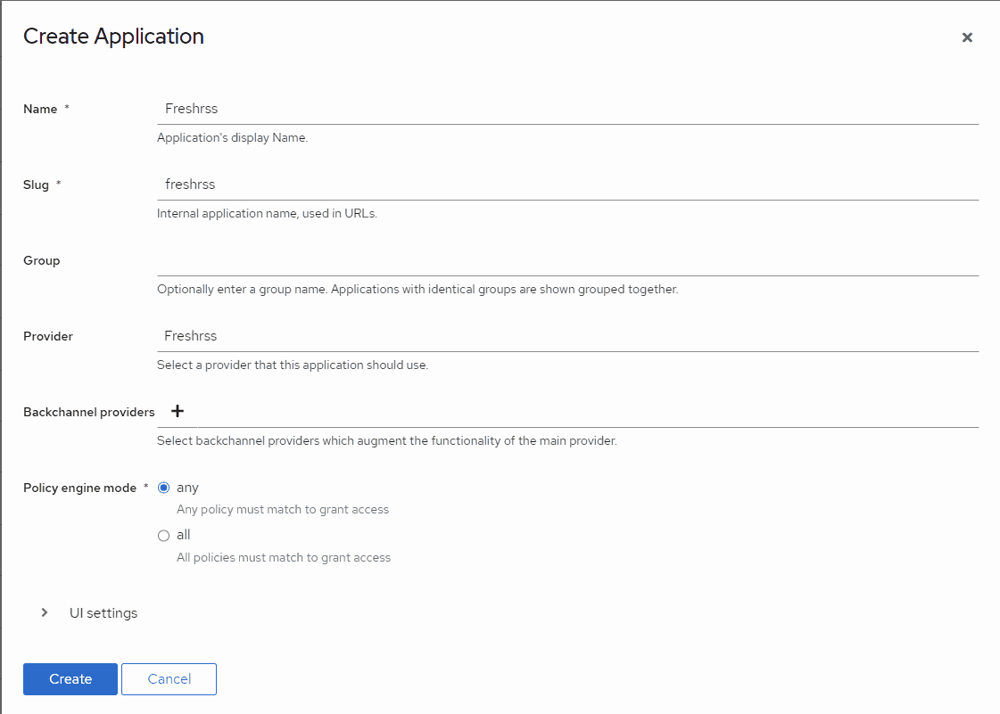
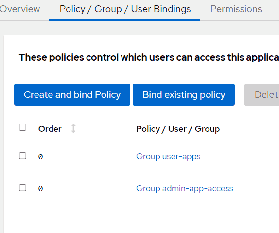

# Setting up Authentik for FreshRSS

**[authentik](https://goauthentik.io/)** is an open-source Identity Provider compatible with OpenID Connect (OIDC) (see [FreshRSS’ OpenID Connect documentation](16_OpenID-Connect.md)).

You can find more information in [authentik integrations documentation](https://goauthentik.io/integrations/services/freshrss/).

## 1. Create OAuth2/OpenID Provider

In authentik Web interface:


Select OAuth2/OpenID Provider. Click Next.

Give it a name, and select your desired auth flows (default flows for this example).
Select *Confidential* Client Type.


Copy the ID / secret for later (you can also come back and get it later).

Set the redirect URIs for FreshRSS: If FreshRSS’ root is `https://freshrss.example.net/`, the proper redirect URI would be `https://freshrss.example.net:443/i/oidc/`.
Note the port number is required even if you are using standard ports (443 for HTTPS).
Without the port number, Authentik will give a `redirect_url` error.

You will need to choose a signing key.
If you don’t have one, generate one under *System > Certificates*.
The default `authentik Self-Signed Certificate` will also work.

Under *Advanced Protocol Settings > Scopes* you will see that email, openid and profile are selected by default.
These are the scopes you will set later in the docker config file.


After you have created the provider, you will need to create an application for it.



Once created, go to *Applications* in Authentik, then select the FreshRSS application you just made.
Select the *Policy > Group > User Bindings* tab at the top.
This is where you define which of your Authentik users are allowed to access this application (FreshRSS).
Select `Bind existing policy` then select either the group or the user tab to add a group of users or a specific user.

> ℹ️ *Suggestion*: make a group such as `app-users` and `app-admin-users` so that you can simply add entire groups to applications. Then when new users are made, they are just added to the group and all your applications will allow them to authenticate.



Finally, go to *Providers*, and click on the OIDC provider you created for FreshRSS.

You will want to copy the `OpenID Configuration URL` value listed.
You will need this in the next step.

## Step 2. Configure FreshRSS’ environment variables

### Kubernetes

Note: this is using a Kubernetes ConfigMap.
However, these are just environment variables mapped into the container.

```yaml
apiVersion: v1
kind: ConfigMap
metadata:
  name: freshrss-config
  namespace: freshrss
data:
  PGID: "100"
  PUID: "65534"
  CRON_MIN: "*/15"
  OIDC_ENABLED: "1"
  # Put your "OpenID Configuration URL" here, from the previous step:
  OIDC_PROVIDER_METADATA_URL: https://authentik.example.net/application/o/freshrss/.well-known/openid-configuration
  OIDC_REMOTE_USER_CLAIM: preferred_username
  # Put your ID here, from the previous step:
  OIDC_CLIENT_ID: t48O5c6z2Ia1XXXXXXX
  # Put your secret here, from the previous step:
  OIDC_CLIENT_SECRET: tDUhtfgxY5mCIZ1M1ItauXXXXX
  # TODO: I have no idea what goes here, but a random string seems to work just fine:
  OIDC_CLIENT_CRYPTO_KEY: WnoO3kRzXynag2XXXXXXXXXX
  OIDC_SCOPES: "openid profile"
  # These headers work for Traefik.
  # May need to be adjusted depending on your proxy configuration:
  OIDC_X_FORWARDED_HEADERS: X-Forwarded-Host X-Forwarded-Port X-Forwarded-Proto
```

### Docker Compose

Secrets can advantageously be put in an `.env` instead of the docker-compose file:

```env
# Taken from authentik oAuth Provider Settings page
OIDC_PROVIDER_METADATA_URL=???
# Taken from authentik oAuth Provider Settings page
OIDC_CLIENT_ID=???
# Taken from authentik oAuth Provider Settings page
OIDC_CLIENT_SECRET=???
# Randomly generated password
OIDC_CLIENT_CRYPTO_KEY=???
```

This is a full example docker-compose file. It uses Traefik reverse proxy, Authentik for OAuth.

```yaml
version: "2.4"

# you will need to define these volumes base on your setup
volumes:
  freshrss-data:
  freshrss-extensions:

networks:
  traefik_proxy:
    name: traefik_proxy
    external: true

services:
  freshrss:
    image: freshrss/freshrss:edge
    container_name: freshrss
    hostname: freshrss
    networks:
      - traefik_proxy
    restart: unless-stopped
    logging:
      options:
        max-size: 10m
    volumes:
      - freshrss-data:/var/www/FreshRSS/data
      - freshrss-extensions:/var/www/FreshRSS/extensions
    # # Portainer defines the env file as show below, but not needed if using the default `.env`
    # env_file:
    #   - ../stack.env
    environment:
      TZ: America/Chicago
      CRON_MIN: '1,31'
      TRUSTED_PROXY: 172.18.0.30 # internal Docker traefik IP address, could use 172.18.0.1/24 instead to allow the entire internal Docker network to proxy
      OIDC_ENABLED: 1
      OIDC_X_FORWARDED_HEADERS: X-Forwarded-Host X-Forwarded-Port X-Forwarded-Proto
      OIDC_SCOPES: openid email profile
      OIDC_REMOTE_USER_CLAIM: preferred_username
    labels:
      - "traefik.enable=true"
      - "traefik.docker.network=traefik_proxy"
      - "traefik.http.routers.fressrss.rule=Host(`rss.example.net`)"
      - "traefik.http.routers.fressrss.entrypoints=https"
      - "traefik.http.routers.fressrss.tls.certresolver=myresolver"
      - "traefik.http.routers.fressrss.service=fressrss"
      - "traefik.http.services.fressrss.loadbalancer.server.port=80"
```

> ℹ️ Not sure where `preferred_username` is defined in authentik but using that does work. This does not need to be changed to something else. Note that the authentik documentation states: `By default, every user that has access to an application can request any of the configured scopes.`


## Step 3. Enable OIDC

During FreshRSS initial setup, or inside of the authentication settings for FreshRSS, set the authentication method to HTTP.

See [FreshRSS’ OpenID Connect documentation](16_OpenID-Connect.md) for more information.
