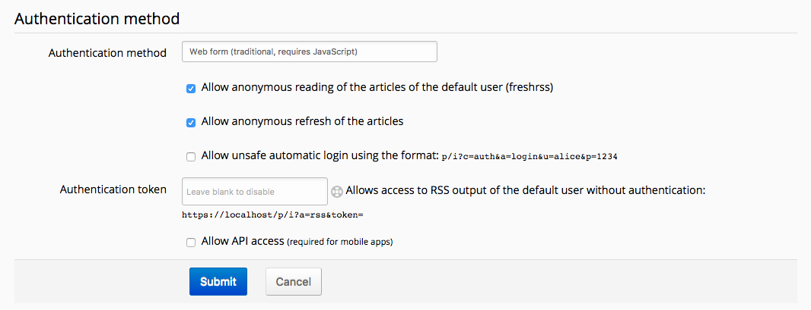
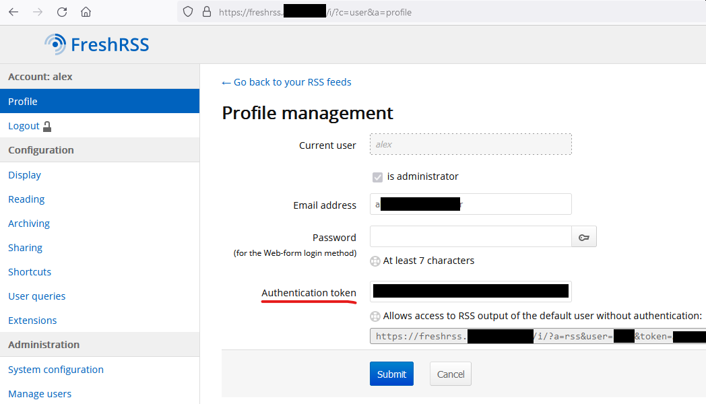
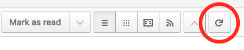
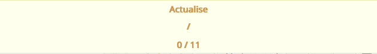
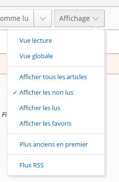

# Normal view

**TODO**

# Global view

**TODO**

# Reader view

**TODO**

# Refreshing feeds

To use FreshRSS at its full potential, it needs to grab subscribed feeds new articles. To do so, you have several methods available.

## Automatic update

This is the recommended method since you can forget about it once it is configured.

### With the actualize_script.php script

This method is available only if you have access to the installation server scheduled tasks.

The script is named *actualize_script.php* and is located in the *app* folder. The scheduled task syntax will not be explained here. However, here is [a quick introduction to crontab](http://www.adminschoice.com/crontab-quick-reference/) that might help you.

Here is an example to trigger article update every hour.

```cron
0 * * * * php /path/to/FreshRSS/app/actualize_script.php > /tmp/FreshRSS.log 2>&1
```

Special parameters to configure the script - all parameters can be combined:

- Parameter "force"  
https://freshrss.example.net/i/?c=feed&a=actualize&force=1  
If force is set to 1 all feeds will be refreshed at once.

- Parameter "ajax"  
https://freshrss.example.net/i/?c=feed&a=actualize&ajax=1  
Only a status site is returned and not a complete website. Example: "OK"

- Parameter "maxFeeds"  
https://freshrss.example.net/i/?c=feed&a=actualize&maxFeeds=30  
If maxFeeds is set the confgured amount of feeds is refreshed at once. The default setting is "10".

- Parameter "token"  
https://freshrss.example.net/i/?c=feed&a=actualize&token=542345872345734  
Security parameter to prevent unauthorized refreshs. For detailed Documentation see "Form authentication".

### Online cron

If you do not have access to the installation server scheduled task, you can still automate the update process.

To do so, you need to create a scheduled task, which need to call a specific URL: https://freshrss.example.net/i/?c=feed&a=actualize (it could be different depending on your installation). Depending on your application authentication method, you need to adapt the scheduled task.

#### No authentication

This is the most straightforward since you have a public instance; there is nothing special to configure:

```cron
0 * * * * curl 'https://freshrss.example.net/i/?c=feed&a=actualize'
```

### Form authentication

If you configure the application to allow anonymous reading, you can also allow anonymous users to update feeds (“Allow anonymous refresh of the articles”).



The URL used in the previous section becomes accessible and therefore, you can use the same syntax for the scheduled task.

You can also configure an authentication token to grant a special right on the server.



The scheduled task syntax to use will be the following:

```cron
0 * * * * curl 'https://freshrss.example.net/i/?c=feed&a=actualize&token=my-token'
```

You can also target a different user by adding their username to the query string, with `&user=insert-username`:

```cron
0 * * * * curl 'https://freshrss.example.net/i/?c=feed&a=actualize&user=someone&token=my-token'
```

### HTTP authentication

In that case, the syntax in the two previous section are unusable. It means that you need to provide your credentials to the scheduled task. **Note that this method is highly discouraged since it means that your credentials will be in plain sight!**

```cron
0 * * * * curl -u alice:password123 'https://freshrss.example.net/i/?c=feed&a=actualize'
```

## Manual update

If you cannot or do not want to use the automatic methods, you can make it manually. There is two ways, the partial or the complete update.

### Complete update

This update occurs on all feeds. To trigger it, you need to click on the navigation menu update link.



When the update starts, a progress bar appears and changes while feeds are processed.



### Partial update

This update occurs on the selected feed only. To trigger it, you need to click on the feed menu update link.


# Filtering articles

While the number of articles stored by FreshRSS increase, it is important to have efficient filters to display only a subset of the articles. There is several methods with different criterion. Most of the time, those methods can be combined.

## By category

This is the easiest method. You only need to click on the category title in the side panel. There are two special categories on top of that panel:

  * *Main feed* which displays only articles from feeds marked as available in that category
  * *Favourites* which displays only articles marked as favourites

## By feed

There is several methods to filter articles by feed:

  * by clicking the feed title in the side panel
  * by clicking the feed title in the article details
  * by filtering in the feed options from the side panel
  * by filtering in the feed configuration


## By status

Each article has two attributes, which can be combined. The first attribute indicates if the article was read or not. The second attribute indicates if the article was marked as favorite or not.

With version 0.7, attribute filters are available in the article display dropdown list. With this version, it is not possible to combine those filters. For instance, it is not possible to display only read and favourite articles.



Starting with version 0.8, all attribute filters are visible as toggle icons. They can be combined. As any combination is possible, some have the same result. For instance, the result for all filters selected is the same as no filter selected.


By default, this filter displays only unread articles

## By content

It is possible to filter articles by their content by inputting a string in the search field.

## With the search field

It is possible to use the search field to further refine results:

* by author: `author:name` or `author:'composed name'`
* by title: `intitle:keyword` or `intitle:'composed keyword'`
* by URL: `inurl:keyword` or `inurl:'composed keyword'`
* by tag: `#tag`
* by free-text: `keyword` or `'composed keyword'`
* by date of discovery, using the [ISO 8601 time interval format](http://en.wikipedia.org/wiki/ISO_8601#Time_intervals): `date:<date-interval>`
	* From a specific day, or month, or year:
		* `date:2014-03-30`
		* `date:2014-03` or `date:201403`
		* `date:2014`
	* From a specific time of a given day:
		* `date:2014-05-30T13`
		* `date:2014-05-30T13:30`
	* Between two given dates:
		* `date:2014-02/2014-04`
		* `date:2014-02--2014-04`
		* `date:2014-02/04`
		* `date:2014-02-03/05`
		* `date:2014-02-03T22:00/22:15`
		* `date:2014-02-03T22:00/15`
	* After a given date:
		* `date:2014-03/`
	* Before a given date:
		* `date:/2014-03`
	* For a specific duration after a given date:
		* `date:2014-03/P1W`
	* For a specific duration before a given date:
		* `date:P1W/2014-05-25T23:59:59`
	* For the past duration before now (the trailing slash is optional):
		* `date:P1Y/` or `date:P1Y` (past year)
		* `date:P2M/` (past two months)
		* `date:P3W/` (past three weeks)
		* `date:P4D/` (past four days)
		* `date:PT5H/` (past five hours)
		* `date:PT30M/` (past thirty minutes)
		* `date:PT90S/` (past ninety seconds)
		* `date:P1DT1H/` (past one day and one hour)
* by date of publication, using the same format: `pubdate:<date-interval>`

Beware that there is no space between the operator and the value.

Some operators can be used negatively, to exclude articles, with the same syntax as above, but prefixed by a `!` or `-`:
`-author:name`, `-intitle:keyword`, `-inurl:keyword`, `-#tag`, `!keyword`.

It is also possible to combine operators to have a very sharp filter, and it is allowed to have multiple instances of `author:`, `intitle:`, `inurl:`, `#`, and free-text.

Combining several search criteria implies a logical *and*, but the keyword ` OR ` can be used to combine several search criteria with a logical *or* instead:
`author:Dupont OR author:Dupond`
