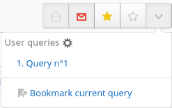

FreshRSS has three primary viewing modes: Normal, Global, and Reader view.

# Normal view

Normal view will allow you to view articles in a compressed view. They can be separated by category or individual feed, or viewed in the "main stream" containing all feeds. Clicking a feed in the sidebar (mobile users will need to click the folder icon to open it) will open that feed's view. 

## Article List

By default, the normal view includes six items per article. From left to right:
* **Read status:** An envalope icon to show if the article has been read or not. Closed envalopes are unread, open envalopes are read. Clicking on the icon will toggle the read status.
* **Favourite status:** A star icon to show if the article has been favourited or not. Filled stars are favourited, empty stars are not. Clicking on the icon will toggle the favourite status.
* **Feed name:** The name of the feed that the article is from. Clicking the feed name will move to that feed's view in normal view.
* **Article title:** The title of the article. Clicking will open the article for viewing within FreshRSS. 
* **Article date/time:** The time the article was posted.
* **Link to original article:** A globe icon that can be clicked to go to the article on the original website.

## Normal View Sidebar

Clicking the gear icon next to an individual feed will display additional options for that feed. 
* **Filter:** Run the defined filter to mark articles as read
* **Statistics:** View statistics about the feed
* **See website:** Open the feed's website in another tab
* **Manage:** Configure the feed
* **Actualize:** Force-update the feed
* **Mark as read:** Mark all items in the feed as read

# Global view

Global view allows quick views of feed's statuses at once. Feeds and categories are shown with the number of unread articles next to them. Clicking a feed's name will open it in a view similar to normal view. 

# Reader view

Reader view will display a feed will all articles already open for reading. Feeds can be switched by clicking the folder icon at the top to bring up the category/feed sidebar.

# Refreshing feeds

To take full advantage of FreshRSS, it needs to retrieve new items from the feeds you have subscribed to. There are several ways to do this.

## Automatic update

This is the recommended method since you can forget about it once it is configured.

### With the actualize_script.php script

This method is only available if you have access to the scheduled tasks of the machine on which your FreshRSS instance is installed.

The script is named *actualize_script.php* and is located in the *app* folder. The scheduled task syntax will not be explained here. However, here is [a quick introduction to crontab](http://www.adminschoice.com/crontab-quick-reference/) that might help you.

Here is an example to trigger article update every hour.

```cron
0 * * * * php /path/to/FreshRSS/app/actualize_script.php > /tmp/FreshRSS.log 2>&1
```

Special parameters to configure the script - all parameters can be combined:

- Parameter "force"
https://freshrss.example.net/i/?c=feed&a=actualize&force=1
If *force* is set to 1 all feeds will be refreshed at once.

- Parameter "ajax"
https://freshrss.example.net/i/?c=feed&a=actualize&ajax=1
Only a status site is returned and not a complete website. Example: "OK"

- Parameter "maxFeeds"
https://freshrss.example.net/i/?c=feed&a=actualize&maxFeeds=30
If *maxFeeds* is set the configured amount of feeds is refreshed at once. The default setting is "10".

- Parameter "token"
https://freshrss.example.net/i/?c=feed&a=actualize&token=542345872345734
Security parameter to prevent unauthorized refreshes. For detailed Documentation see "Form authentication".

### Online cron

If you do not have access to the installation server scheduled task, you can still automate the update process.

To do so, you need to create a scheduled task, which need to call a specific URL: https://freshrss.example.net/i/?c=feed&a=actualize (it could be different depending on your installation). Depending on your application authentication method, you need to adapt the scheduled task.

#### No authentication

This is the most straightforward since you have a public instance; there is nothing special to configure:

```cron
0 * * * * curl 'https://freshrss.example.net/i/?c=feed&a=actualize'
```

### Form authentication

If you configure the application to allow anonymous reading, you can also allow anonymous users to update feeds (“Allow anonymous refresh of the articles”).


The URL used in the previous section will now become accessible to anyone. Therefore you can use the same syntax for the scheduled task.

You can also configure an authentication token to grant special access on the server.


The scheduled task syntax should look as follows:

```cron
0 * * * * curl 'https://freshrss.example.net/i/?c=feed&a=actualize&token=my-token'
```

You can also target a different user by adding their username to the query string, with `&user=insert-username`:

```cron
0 * * * * curl 'https://freshrss.example.net/i/?c=feed&a=actualize&user=someone&token=my-token'
```

### HTTP authentication

When using HTTP authentication, the syntax in the two previous sections is unusable. You'll need to provide your credentials to the scheduled task. **Note that this method is highly discouraged since it means that your credentials will be in plain sight!**

```cron
0 * * * * curl -u alice:password123 'https://freshrss.example.net/i/?c=feed&a=actualize'
```

## Manual update

If you can't or don't want to use the automatic method, you can update manually. There are two methods for updating all or some of the feeds.

### Complete update

This update occurs on all feeds. To trigger it, simply click on the update link in the navigation menu.


When the update starts, a progress bar appears and changes while feeds are processed.


### Partial update

This update occurs on the selected feed only. To trigger it, simply click on the update link in the feed menu.


# Filtering articles

## Purpose
When the number of articles stored by FreshRSS inevitably grows larger, it's important to use efficient filters to display only a subset of the articles. There are several methods that filter with different criteria. Usually those methods can be combined.

## How-to filter

### By category

This is the easiest method. You only need to click on the category title in the side panel. There are two special categories at the top of the panel:

  * *Main feed* displays only articles from feeds marked as available in that category
  * *Favourites* displays only articles marked as favourites

### By feed

There are several methods to filter articles by feed:

  * by clicking the feed title in the side panel
  * by clicking the feed title in the article details
  * by filtering in the feed options from the side panel
  * by filtering in the feed configuration


### By status

Each article has two attributes that can be combined. The first attribute indicates whether or not the article has been read. The second attribute indicates if the article was marked as favorite or not.

In version 0.7, attribute filters are available in the article display dropdown list. With this version, it's not possible to combine filters. For instance, it's not possible to display only read and favorite articles.


Starting with version 0.8, all attribute filters are visible as toggle icons. They can be combined. As any combination is possible, some have the same result. For instance, the result for all filters selected is the same as no filter selected.


By default, this filter displays only unread articles

### By content

It is possible to filter articles by their content by inputting a string in the search field.

### With the search field

You can use the search field to further refine results:

* by feed ID: `f:123` or multiple feed IDs: `f:123,234,345`
* by author: `author:name` or `author:'composed name'`
* by title: `intitle:keyword` or `intitle:'composed keyword'`
* by URL: `inurl:keyword` or `inurl:'composed keyword'`
* by tag: `#tag` or `#tag+with+whitespace`
* by free-text: `keyword` or `'composed keyword'`
* by date of discovery, using the [ISO 8601 time interval format](http://en.wikipedia.org/wiki/ISO_8601#Time_intervals): `date:<date-interval>`
	* From a specific day, or month, or year:
		* `date:2014-03-30`
		* `date:2014-03` or `date:201403`
		* `date:2014`
	* From a specific time of a given day:
		* `date:2014-05-30T13`
		* `date:2014-05-30T13:30`
	* Between two given dates:
		* `date:2014-02/2014-04`
		* `date:2014-02--2014-04`
		* `date:2014-02/04`
		* `date:2014-02-03/05`
		* `date:2014-02-03T22:00/22:15`
		* `date:2014-02-03T22:00/15`
	* After a given date:
		* `date:2014-03/`
	* Before a given date:
		* `date:/2014-03`
	* For a specific duration after a given date:
		* `date:2014-03/P1W`
	* For a specific duration before a given date:
		* `date:P1W/2014-05-25T23:59:59`
	* For the past duration before now (the trailing slash is optional):
		* `date:P1Y/` or `date:P1Y` (past year)
		* `date:P2M/` (past two months)
		* `date:P3W/` (past three weeks)
		* `date:P4D/` (past four days)
		* `date:PT5H/` (past five hours)
		* `date:PT30M/` (past thirty minutes)
		* `date:PT90S/` (past ninety seconds)
		* `date:P1DT1H/` (past one day and one hour)
* by date of publication, using the same format: `pubdate:<date-interval>`

Be careful not to enter a space between the operator and the search value.

Some operators can be used negatively, to exclude articles, with the same syntax as above, but prefixed by a `!` or `-`:
`!f:234`, `-author:name`, `-intitle:keyword`, `-inurl:keyword`, `-#tag`, `!keyword`, `!date:2019`, `!date:P1W`, `!pubdate:P3d/`.

It is also possible to combine keywords to create a more precise filter.
For example, you can enter multiple instances of `f:`, `author:`, `intitle:`, `inurl:`, `#`, and free-text.

Combining several search criteria implies a logical *and*, but the keyword ` OR `
can be used to combine several search criteria with a logical *or* instead: `author:Dupont OR author:Dupond`

### By sorting by date

You can change the sort order by clicking the toggle button available in the header.

## Store your filters

Once you came up with your perfect filter, it would be a shame if you need to recreate it every time you need to use it.

Hopefully, there is a way to bookmark them for later use.
We call them _user queries_.
You can create as many as you want, the only limit is how they will be displayed on your screen.

### Bookmark the current query

Display the user queries drop-down by clicking the button next to the state buttons.


Then click on the bookmark action.

Congratulations, you're done!

### Using a bookmarked query

Display the user queries drop-down by clicking the button next to the state buttons.


Then click on the bookmarked query, the previously stored query will be applied.

> Note that only the query is stored, not the articles.
> The results you are seing now could be different from the results on the day you've created the query.
