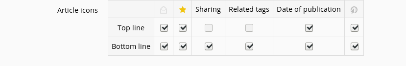
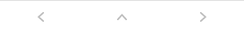
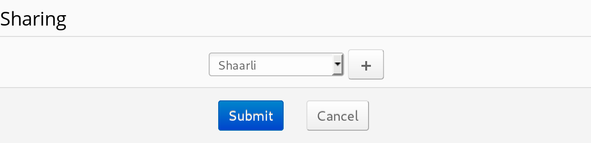

# Display

## Language

FreshRSS is currently available in 14 languages. After confirming your choice, the interface will be displayed in your preferred language.
Depending on the language chosen, parts of the interface may not be not translated yet. If you're willing to help translate
the missing bits or would like to add a new language, please take a look at how you can [contribute to the project](../contributing.md#contribute-to-internationalization-i18n).

Some parts of FreshRSS aren't translated and aren't intended to be translated either. For now, this includes the logs visible in the application as well as the log generated by automatic update scripts.

Available languages are: cz, de, en, es, fr, he, it, kr, nl, oc, pt-br, ru, tr, zh-cn.

## Theme

There's no accounting for tastes, which is why FreshRSS offers eight official themes:

 * *Blue Lagoon* by **Mister aiR**
 * *Dark* by **AD**
 * *Flat design* by **Marien Fressinaud**
 * *Origine* by **Marien Fressinaud**
 * *Origine-compact* by **Kevin Papst**
 * *Pafat* by **Plopoyop**
 * *Screwdriver* by **Mister aiR**
 * *Swage* by **Patrick Crandol**

If you can't find any themes you like, it's always possible to [create your own](../developers/04_Frontend/02_Design.md).

To select a theme, simply scroll through the themes and select one that strikes your fancy. After confirmation, the theme will be applied to the interface.

## Content width

Some people prefer short lines of text, while others prefer to maximize the available screen space. To satisfy the maximum number of people, it's possible to customize the width of the displayed content. There are four settings available:

 * **Fine** displays content up to a maximum width of 550 pixels
 * **Medium** displays content up to a maximum width of 800 pixels
 * **Large** displays content up to a maximum width of 1000 pixels
 * **No limit** displays the content on 100% of the available space

## Article icons

Please note that this section only affects normal view.



Each article is rendered with a header (top line) and a footer (bottom line).
In that section, you can choose what will be displayed in those.

If you disable every item in the top line, you'll still be able to see it since
it contains the feed name and the article title. But if you do the same thing for
the bottom line, it will be empty.

## HTML5 notification timout

After automatically updating the feeds, FreshRSS can pop up a notification using the HTML5 notification API.

The duration of this notification can be set. By default, the value is 0.

## Show the navigation button

By default, FreshRSS displays buttons to ease the article navigation when browsing on mobile. The drawback is that they eat up some precious space.



If you don't use those buttons because you never browse on mobile or because you browse with gestures, you can disable them from the interface.

# Reading

**TODO**

# Archival

**TODO**

# Sharing

To make your life easier, you can share articles straight from FreshRSS.

At the moment, FreshRSS supports 18 sharing methods, ranging from self-hosted services (Shaarli, etc.) to proprietary services (Facebook, etc.).

By default, the sharing list is empty.


To add a new item to the list, please follow the following simple steps:

 1. Select the desired sharing method in the drop-down list.
 1. Press the ```✚``` button to add it to the list.
 1. Configure the method in the list. All  names can be modified in the display. Some methods need the sharing URL to be able to work properly (ex: Shaarli).
 1. Submit your changes.

To remove an item from the list, follow those simple steps:

 1. Press the ```❌``` button next to the share method you want to remove.
 1. Submit your changes.

# Shortcuts

To ease the use of the application, FreshRSS comes with a lot of predefined keyboard shortcuts.
They allow actions to improve the user experience with a keyboard.

Of course, if you're not satisfied with the key mapping, you can change you configuration to fit your needs.

There are 4 types of shortcuts:

 1. Views: they allow switching views with ease.
 1. Navigation: they allow navigation through articles, feeds, and categories.
 1. Article actions: they allow interactions with an article, like sharing or opening it on the original web-site.
 1. Other actions: they allow other interactions with the application, like opening the user queries menu or accessing the documentation.

It's worth noting that the share article action has two levels. Once you press the shortcut, a menu containing all the share options opens.
To choose one share option, you need to select it by its number. When there is only one option, it's selected automatically though.

The same process applies to the user queries.

Be aware that there is no validation on the selected shortcuts.
This means that if you assign a shortcut to more than one action, you'll end up with some unexpected behavior.

# User queries

You can configure your [user queries](./03_Main_view.md) in that section. There is not much to say here as it is pretty straightforward.
You can only change user query titles or drop them.

At the moment, there is no helper to build a user query from here.

# Users

**TODO**

## Authentication methods

### HTTP Authentication (Apache)

 1. User control is based on the `.htaccess` file.
 2. It is best practice to place the `.htaccess` file in the `./i/` subdirectory so the API and other third party services can work.
 3. If you want to limit all access to registered users only, place the file in the FreshRSS directory itself or in a parent directory. Note that WebSub and API will not work!
 4. Example `.htaccess` file for a user "marie":

```
AuthUserFile /home/marie/repertoire/.htpasswd
AuthGroupFile /dev/null
AuthName "Chez Marie"
AuthType Basic
Require user marie
```

More information can be found in the [Apache documentation](http://httpd.apache.org/docs/trunk/howto/auth.html#gettingitworking).

# Subscription management

## Information

**TODO**

## Archival

**TODO**

## Login

**TODO**

## Advanced

### Retrieve a truncated stream from within FreshRSS

This question comes up regularly, so we'll try to clarify how one can retrieve a truncated RSS feed with FreshRSS. Please note that the process is absolutely not user friendly, but it works. :)

Please be aware that this way you'll generate much more traffic to the originating sites, and they might block you accordingly. FreshRSS performance is also negatively affected, because you'll have to fetch the full article content one by one. So it's a feature to use sparingly!

What's meant by "CSS path of articles on the original site" actually corresponds to the "path" consisting of IDs and classes (which in HTML, matches the id and class attributes) to retrieve only the interesting part that corresponds to the article. Ideally, this path starts with an id (which is unique to the page).

#### Example: Rue89

To find this path, you have to go to the address of one of the truncated articles (for example, http://www.rue89.com/2013/10/15/prof-maths-jai-atteint-lextase-dihn-pedagogie-inversee-246635). You look have to look for the "block" of HTML that corresponds to article content (in the source code!).

Here we find that the block that encompasses nothing but the content of the article is ```<div class="content clearfix">```. We'll only use the `.content` class here. Nevertheless, as said above, it's best to start the path with an id. If we go back to the parent block, we find ```<div id="article">``` and that's perfect! The path will be ```#article .content```.

#### Add the corresponding classes to the article CSS path on the feed configuration page. Examples:

*  Rue89: ```#article .content```
*  PCINpact: ```#actu_content```
*  Lesnumériques: ```article#body div.text.clearfix```
*  Phoronix: ```#main .content```

#### Combining CSS Classes
Let's say we have an article which contains ads within its content, and we do not want to have those ads retrieved by FreshRSS. Example Source Code:
```
<div id='article'>
<h2>wanted</h2>
<p class='content'>wanted content</p>
<p class='ad'>unwanted content</p>
<h2>wanted</h2>
<p class='content'>wanted content</p>
<h2>wanted</h2>
<p class='ad'>unwanted content</p>
<p class='content'>wanted content</p>
</div>
```
In this case it's possible to combine multiple CSS selectors with a comma: ```#article p.content, #article h2```

### Retrieve a truncated stream with external tools

Complimentary tools can be used to retrieve full article content, such as:

* [RSS-Bridge](https://github.com/RSS-Bridge/rss-bridge)
* [Full-Text RSS](https://bitbucket.org/fivefilters/full-text-rss)
