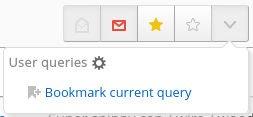
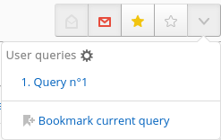

# Filtering articles

## Purpose

When the number of articles stored by FreshRSS inevitably grows larger, it’s important to use efficient filters to display only a subset of the articles. There are several methods that filter with different criteria. Usually those methods can be combined.

## By category

This is the easiest method. You only need to click on the category title in the side panel. There are two special categories at the top of the panel:

* *Main feed* displays only articles from feeds marked as available in that category
* *Favourites* displays only articles marked as favourites

## By feed

There are several methods to filter articles by feed:

* by clicking the feed title in the side panel
* by clicking the feed title in the article details
* by filtering in the feed options from the side panel
* by filtering in the feed configuration

## By status

Each article has two attributes that can be combined. The first attribute indicates whether or not the article has been read. The second attribute indicates if the article was marked as favorite or not.

In version 0.7, attribute filters are available in the article display dropdown list. With this version, it’s not possible to combine filters. For instance, it’s not possible to display only read and favorite articles.

Starting with version 0.8, all attribute filters are visible as toggle icons. They can be combined. As any combination is possible, some have the same result. For instance, the result for all filters selected is the same as no filter selected.

By default, this filter displays only unread articles

## By content

It is possible to filter articles by their content by inputting a string in the search field.

## With the search field

You can use the search field to further refine results:

* by feed ID: `f:123` or multiple feed IDs (*or*): `f:123,234,345`
* by author: `author:name` or `author:'composed name'`
* by title: `intitle:keyword` or `intitle:'composed keyword'`
* by URL: `inurl:keyword` or `inurl:'composed keyword'`
* by tag: `#tag` or `#tag+with+whitespace`
* by free-text: `keyword` or `'composed keyword'`
* by date of discovery, using the [ISO 8601 time interval format](http://en.wikipedia.org/wiki/ISO_8601#Time_intervals): `date:<date-interval>`
	* From a specific day, or month, or year:
		* `date:2014-03-30`
		* `date:2014-03` or `date:201403`
		* `date:2014`
	* From a specific time of a given day:
		* `date:2014-05-30T13`
		* `date:2014-05-30T13:30`
	* Between two given dates:
		* `date:2014-02/2014-04`
		* `date:2014-02--2014-04`
		* `date:2014-02/04`
		* `date:2014-02-03/05`
		* `date:2014-02-03T22:00/22:15`
		* `date:2014-02-03T22:00/15`
	* After a given date:
		* `date:2014-03/`
	* Before a given date:
		* `date:/2014-03`
	* For a specific duration after a given date:
		* `date:2014-03/P1W`
	* For a specific duration before a given date:
		* `date:P1W/2014-05-25T23:59:59`
	* For the past duration before now (the trailing slash is optional):
		* `date:P1Y/` or `date:P1Y` (past year)
		* `date:P2M/` (past two months)
		* `date:P3W/` (past three weeks)
		* `date:P4D/` (past four days)
		* `date:PT5H/` (past five hours)
		* `date:PT30M/` (past thirty minutes)
		* `date:PT90S/` (past ninety seconds)
		* `date:P1DT1H/` (past one day and one hour)
* by date of publication, using the same format: `pubdate:<date-interval>`
* by custom label ID `L:12` or multiple label IDs: `L:12,13,14` or with any label: `L:*`
* by custom label name `label:label`, `label:"my label"` or any label name from a list (*or*): `labels:"my label,my other label"`
* by several label names (*and*): `label:"my label" label:"my other label"`
* by entry (article) ID: `e:1639310674957894` or multiple entry IDs  (*or*): `e:1639310674957894,1639310674957893`
* by user query (saved search) name: `search:myQuery`, `search:"My query"` or saved search ID: `S:3`
	* internally, those references are replaced by the corresponding user query in the search expression

Be careful not to enter a space between the operator and the search value.

Some operators can be used negatively, to exclude articles, with the same syntax as above, but prefixed by a `!` or `-`:
`!f:234`, `-author:name`, `-intitle:keyword`, `-inurl:keyword`, `-#tag`, `!keyword`, `!date:2019`, `!date:P1W`, `!pubdate:P3d/`.

It is also possible to combine keywords to create a more precise filter.
For example, you can enter multiple instances of `f:`, `author:`, `intitle:`, `inurl:`, `#`, and free-text.

Combining several search criteria implies a logical *and*, but the keyword ` OR `
can be used to combine several search criteria with a logical *or* instead: `author:Dupont OR author:Dupond`

You don’t have to do anything special to combine multiple negative operators. Writing `!intitle:'thing1' !intitle:'thing2'` implies AND, see above. For more pointers on how AND and OR interact with negation, see [this GitHub comment](https://github.com/FreshRSS/FreshRSS/issues/3236#issuecomment-891219460).
Additional reading: [De Morgan’s laws](https://en.wikipedia.org/wiki/De_Morgan%27s_laws).

Finally, parentheses may be used to express more complex queries, with basic negation support:

* `(author:Alice OR intitle:hello) (author:Bob OR intitle:world)`
* `(author:Alice intitle:hello) OR (author:Bob intitle:world)`
* `!((author:Alice intitle:hello) OR (author:Bob intitle:world))`
* `(author:Alice intitle:hello) !(author:Bob intitle:world)`
* `!(S:1 OR S:2)`

> ℹ️ If you need to search for a parenthesis, it needs to be escaped like `\(` or `\)`

## By sorting by date

You can change the sort order by clicking the toggle button available in the header.

## Store your filters

Once you came up with your perfect filter, it would be a shame if you need to recreate it every time you need to use it.

Hopefully, there is a way to bookmark them for later use.
We call them *user queries*.
You can create as many as you want, the only limit is how they will be displayed on your screen.

### Bookmark the current query

Display the user queries drop-down by clicking the button next to the state buttons.

Then click on the bookmark action.

Congratulations, you’re done!

### Using a bookmarked query

Display the user queries drop-down by clicking the button next to the state buttons.

Then click on the bookmarked query, the previously stored query will be applied.

> Note that only the query is stored, not the articles.
> The results you are seeing now could be different from the results on the day you've created the query.

---
Read more:
* [Normal, Global and Reader view](./03_Main_view.md)
* [Refreshing the feeds](./09_refreshing_feeds.md)
