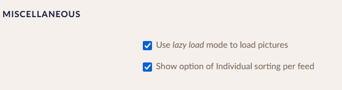
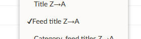
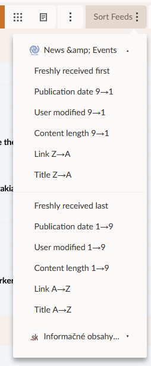

# Sorting By Feed

## Enabling sorting by feed

Option of idividual sorting by feed can be turned on eading menu of configuration. It is located at the bottom of the page.

## How to

When option of sorting articles by feed is set another button besides is displayed which allows to sort articles within chosen feed by chosen metric.

Button has dropdown menu with feeds currently displayed on View. When clicking on one feed, menu with sorting option for that specific feed is show. Chosing one sort option will sort all articles in that feed acordingly.

---
Read more:
* [Normal, Global and Reader view](./03_Main_view.md)
* [Filtering Articles](./10_filter.md)
* [Refreshing the feeds](./09_refreshing_feeds.md)
* [User queries](./user_queries.md)

