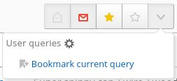
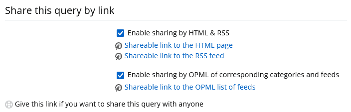

# User queries

*User queries* are a way to store any FreshRSS search query.

Read about [the filters](./10_filter.md) to learn the different ways to search and filter
articles in FreshRSS.

## Bookmark the current query

Once you have a search query with a filter, it can be saved.

To do so, display the user queries drop-down manu by clicking the button next to the state buttons:

Then click on the bookmark action.

## Using a bookmarked query

Display the user queries drop-down menu by clicking the button next to the state buttons:

Then click on the bookmarked query, the previously stored query will be applied.

> ℹ️ Note that only the search query is stored, not the articles.
> So the results you are seeing one day might be different another day.

## Share your user queries

From the configuration page of the user queries,
it is possible to share the output of the user queries with external users,
in the formats HTML, RSS, and OPML:

> ℹ️ Note that the sharing as OPML is only available for user queries based on all feeds, a category, or a feed.
> Sharing by OPML is **not** available for queries based on user labels or favourites or important feeds,
> to avoid leaking some feed details in an unintended manner.

### Additional parameters for shared user queries

Some parameters can be manually added to the URL:

* `hours`: Show only the articles newer than this number of hours.
* `nb`: Number of articles to return. Limited by `max_posts_per_rss` in the user configuration. Can be use in combination with `offset` for pagination.
* `offset`: Skip a number of articles. Used in particular by the HTML view for pagination.
* `order`: Show the newest articles at the top with `DESC`, or the oldest articles at the top with `ASC`. By default, will use the sort order defined by the user query.
