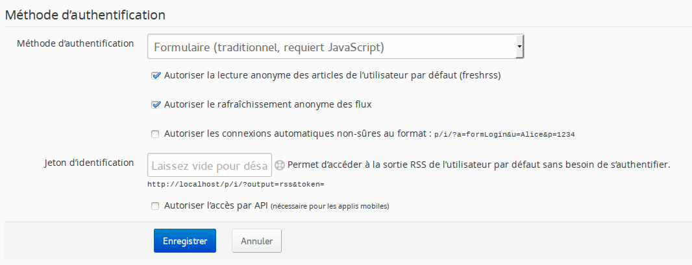
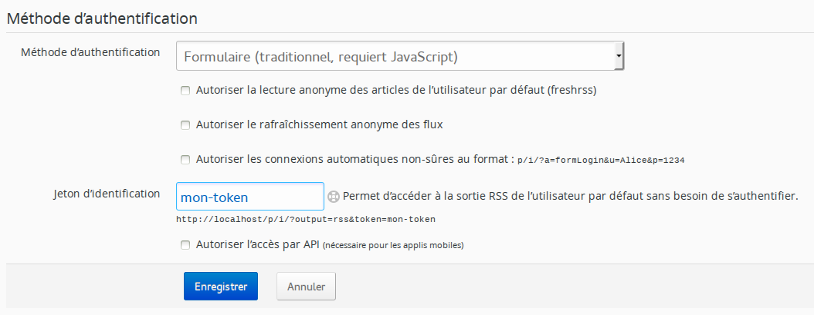
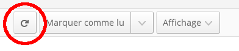
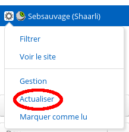
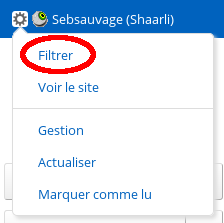
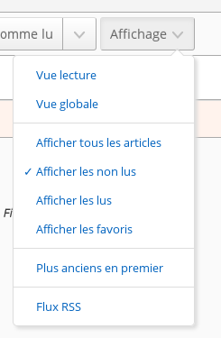

# La vue normale

**TODO**

# La vue globale

**TODO**

# La vue lecture

**TODO**

# Rafraîchir les flux

Pour profiter pleinement de FreshRSS, il faut qu’il récupère les nouveaux articles disponibles des flux auxquels vous avez souscrit. Pour cela, il existe plusieurs méthodes.

## Mise à jour automatique

C’est la méthode recommandée car il n’y a pas besoin d’y penser, elle se fait toute seule, à la fréquence que vous avez choisi.

### Par le script actualize_script.php

Cette méthode n’est possible que si vous avez accès aux tâches planifiées de la machine sur laquelle est installée votre instance de FreshRSS.

Le script qui permet de mettre à jour les articles s’appelle *actualize_script.php* et se trouve dans le répertoire *app* de votre instance de FreshRSS. La syntaxe des tâches planifiées ne sera pas expliqué ici, cependant voici [une introduction rapide à crontab](http://www.adminschoice.com/crontab-quick-reference/) qui peut vous aider.

Ci-dessous vous trouverez un exemple permettant la mise à jour des articles toutes les heures.

```cron
0 * * * * php /chemin/vers/FreshRSS/app/actualize_script.php > /tmp/FreshRSS.log 2>&1
```


### Cron en-ligne

Il se peut que vous n’ayez pas accès aux tâches planifiées du serveur hébergeant votre instance de FreshRSS. Il reste une possibilité pour mettre les flux à jour automatiquement.

Pour cela vous devez paramétrer une tâche cron qui devra charger régulièrement une url spécifique : https://freshrss.example.net/i/?c=feed&a=actualize (à adapter selon votre installation). Différents cas de figure peuvent se présenter à vous désormais.

##### Aucune authentification

C’est le cas le plus simple, puisque votre instance est publique, vous n’avez rien de particulier à préciser :

```cron
0 * * * * curl 'https://freshrss.example.net/i/?c=feed&a=actualize'
```

Vous pouvez également choisir un utilisateur différent en ajoutant son nom d'utilisateur à la chaîne de requête, avec `&user=nom-dutilisateur` :

```cron
0 * * * * curl 'https://freshrss.example.net/i/?c=feed&a=actualize&user=someone&token=my-token'
```

##### Authentification par formulaire

Dans ces cas-là, si vous avez autorisé la lecture anonyme des articles, vous pouvez aussi permettre à n’importe qui de rafraîchir vos flux (« Autoriser le rafraîchissement anonyme des flux »).



L’url précédente devient donc accessible à n’importe qui et vous pouvez utiliser la tâche cron de la partie précédente.

Vous pouvez aussi configurer un jeton d’authentification pour accorder un droit spécial sur votre serveur.



La tâche cron à utiliser sera de la forme suivante :

```cron
0 * * * * curl 'https://freshrss.example.net/i/?c=feed&a=actualize&token=mon-token'
```


##### Authentification HTTP

Dans ce cas-là, le token et les permissions “anonymes” sont inutilisables et il vous sera nécessaire d’indiquer vos identifiants dans la tâche cron. **Notez que cette solution est grandement déconseillée puisqu’elle implique que vos identifiants seront visibles en clair !**

```cron
0 * * * * curl -u alice:password123 'https://freshrss.example.net/i/?c=feed&a=actualize'
```

## Mise à jour manuelle

Si vous ne pouvez pas ou ne voulez pas utiliser la méthode automatique, vous pouvez le faire de façon manuelle. Il existe deux méthodes qui permettent de mettre à jour tout ou partie des flux.

### Mise à jour complète

Cette mise à jour se fait pour l’ensemble des flux de l’instance. Pour initier cette mise à jour, il suffit de cliquer sur le lien de mise à jour disponible dans le menu de navigation.



Lorsque la mise à jour démarre, une barre de progression apparait et s’actualise au fur et à mesure de la récupération des articles.


### Mise à jour partielle

Cette mise à jour se fait pour le flux sélectionné uniquement. Pour initier cette mise à jour, il suffit de cliquer sur le lien de mise à jour disponible dans le menu du flux.



# Filtrer les articles

Avec le nombre croissant d’articles stockés par FreshRSS, il devient important d’avoir des filtres efficaces pour n’afficher qu’une partie des articles. Il existe plusieurs méthodes qui filtrent selon des critères différents. Ces méthodes peuvent être combinées dans la plus part des cas.

##Par catégorie

C’est la méthode la plus simple. Il suffit de cliquer sur le titre d’une catégorie dans le panneau latéral. Il existe deux catégories spéciales qui sont placées en haut dudit panneau :

  * *Flux principal* qui affiche uniquement les articles des flux marqués comme visible dans cette catégorie
  * *Favoris* qui affiche uniquement les articles, tous flux confondus, marqués comme favoris

##Par flux

Il existe plusieurs méthodes pour filtrer les articles par flux :

  * en cliquant sur le titre du flux dans le panneau latéral
  * en cliquant sur le titre du flux dans le détail de l’article
  * en filtrant dans les options du flux dans le panneau latéral
  * en filtrant dans la configuration du flux



##Par statut

Chaque article possède deux attributs qui peuvent être combinés. Le premier attribut indique si l’article a été lu ou non. Le second attribut indique si l’article a été noté comme favori ou non.

Dans la version 0.7.x, les filtres sur les attributs sont accessibles depuis la liste déroulante qui gère l’affichage des articles. Dans cette version, il n’est pas possible de combiner les filtres. Par exemple, on ne peut pas afficher les articles lus qui ont été notés comme favori.



À partir de la version 0.8, les filtres sur les attributs sont directement accessibles. Il est maintenant possible de les combiner. Comme il est possible de faire toutes les combinaisons, il y en a certaines qui retournent le même résultat. Par exemple, si les quatre filtres sont activés ou désactivés, le résultat sera le même.


Par défaut, le filtre n’affiche que les articles qui n’ont pas été lus.

##Par contenu

Il est possible de filtrer les articles par leur contenu en entrant une chaine de caractères dans le champ de recherche prévu à cet effet.

##Grâce au champ de recherche

Il est possible d’utiliser le champ de recherche pour raffiner les résultats :

* par auteur : `author:nom` or `author:'nom composé'`
* par titre : `intitle:mot` or `intitle:'mot composé'`
* par URL: `inurl:mot` or `inurl:'mot composé'`
* par tag: `#tag`
* par texte libre : `mot` or `'mot composé'`
* par date de découverte, en utilisant le [format d’intervalle de dates ISO 8601](https://fr.wikipedia.org/wiki/ISO_8601#Les_dur.C3.A9es_et_intervalles) : `date:<intervalle>`
	* D’un jour, mois, ou année :
		* `date:2014-03-30`
		* `date:2014-03` or `date:201403`
		* `date:2014`
	* D’une heure précise d’un jour donné :
		* `date:2014-05-30T13`
		* `date:2014-05-30T13:30`
	* Entre deux dates :
		* `date:2014-02/2014-04`
		* `date:2014-02--2014-04`
		* `date:2014-02/04`
		* `date:2014-02-03/05`
		* `date:2014-02-03T22:00/22:15`
		* `date:2014-02-03T22:00/15`
	* Après une date donnée :
		* `date:2014-03/`
	* Avant une date donnée :
		* `date:/2014-03`
	* Pour une certaine durée après une date donnée :
		* `date:2014-03/P1W`
	* Pour une certaine durée avant une date donnée :
		* `date:P1W/2014-05-25T23:59:59`
	* Pour une certaine durée avant l’instant présent (la barre oblique est optionnelle) :
		* `date:P1Y/` ou `date:P1Y` (depuis un an)
		* `date:P2M/` (depuis deux mois)
		* `date:P3W/` (depuis trois semaines)
		* `date:P4D/` (depuis quatre jours)
		* `date:PT5H/` (depuis cinq heures)
		* `date:PT30M/` (depuis trente minutes)
		* `date:PT90S/` (depuis 90 seconds)
		* `date:P1DT1H/` (depuis un jour et une heure)
* par date de publication, en utilisant le même format : `pubdate:<intervalle>`

Attention à ne pas introduire d’espace entre l’opérateur et la valeur recherchée.

Certains opérateurs peuvent être utilisé négativement, pour exclure des articles, avec la même syntaxe que ci-dessus, mais préfixé par `!` ou `-` :
`-author:nom`, `-intitle:mot`, `-inurl:mot`, `-#tag`, `!mot`.

Il est également possible de combiner les mots-clefs pour faire un filtrage encore plus précis, et il est autorisé d’avoir plusieurs instances de : `author:`, `intitle:`, `inurl:`, `#`, et texte libre.

Combiner plusieurs critères implique un *et* logique, mais le mot clef ` OR ` peut être utiliser pour combiner plusieurs critères avec un *ou* logique :
`author:Dupont OR author:Dupond`
