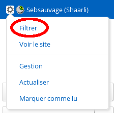
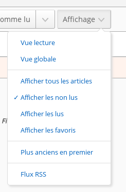

# Filtrer les articles

## Purpose

Avec le nombre croissant d’articles stockés par FreshRSS, il devient
important d’avoir des filtres efficaces pour n’afficher qu’une partie des
articles. Il existe plusieurs méthodes qui filtrent selon des critères
différents. Ces méthodes peuvent être combinées dans la plus part des cas.

## Par catégorie

C’est la méthode la plus simple. Il suffit de cliquer sur le titre d’une
catégorie dans le panneau latéral. Il existe deux catégories spéciales qui
sont placées en haut dudit panneau :

* *Flux principal* qui affiche uniquement les articles des flux marqués
  comme visible dans cette catégorie
* *Favoris* qui affiche uniquement les articles, tous flux confondus,
  marqués comme favoris

## Par flux

Il existe plusieurs méthodes pour filtrer les articles par flux :

* en cliquant sur le titre du flux dans le panneau latéral
* en cliquant sur le titre du flux dans le détail de l’article
* en filtrant dans les options du flux dans le panneau latéral
* en filtrant dans la configuration du flux

## Par statut

Chaque article possède deux attributs qui peuvent être combinés. Le premier
attribut indique si l’article a été lu ou non. Le second attribut indique si
l’article a été noté comme favori ou non.

Dans la version 0.7.x, les filtres sur les attributs sont accessibles depuis
la liste déroulante qui gère l’affichage des articles. Dans cette version,
il n’est pas possible de combiner les filtres. Par exemple, on ne peut pas
afficher les articles lus qui ont été notés comme favori.

Starting with version 0.8, all attribute filters are visible as toggle
icons. They can be combined. As any combination is possible, some have the
same result. For instance, the result for all filters selected is the same
as no filter selected.

By default, this filter displays only unread articles

## By content

It is possible to filter articles by their content by inputting a string in
the search field.

## Grâce au champ de recherche

Il est possible d’utiliser le champ de recherche pour raffiner les résultats
:

* by feed ID: `f:123` or multiple feed IDs (*or*): `f:123,234,345`
* by category ID: `c:23` or multiple category IDs (*or*): `c:23,34,45`
* par auteur : `author:nom` or `author:'nom composé'`
* par titre : `intitle:mot` or `intitle:'mot composé'`
* by text (content): `intext:keyword` or `intext:'composed keyword'`
* par URL: `inurl:mot` or `inurl:'mot composé'`
* by tag: `#tag` or `#tag+with+whitespace` or `#'tag with whitespace'`
* par texte libre : `mot` ou `'mot composé'`
* by date of discovery, using the [ISO 8601 time interval
  format](http://en.wikipedia.org/wiki/ISO_8601#Time_intervals):
  `date:<date-interval>`
	* From a specific day, or month, or year:
		* `date:2014-03-30`
		* `date:2014-03` or `date:201403`
		* `date:2014`
	* From a specific time of a given day:
		* `date:2014-05-30T13`
		* `date:2014-05-30T13:30`
	* Between two given dates:
		* `date:2014-02/2014-04`
		* `date:2014-02--2014-04`
		* `date:2014-02/04`
		* `date:2014-02-03/05`
		* `date:2014-02-03T22:00/22:15`
		* `date:2014-02-03T22:00/15`
	* After a given date:
		* `date:2014-03/`
	* Before a given date:
		* `date:/2014-03`
	* For a specific duration after a given date:
		* `date:2014-03/P1W`
	* For a specific duration before a given date:
		* `date:P1W/2014-05-25T23:59:59`
	* For the past duration before now (the trailing slash is optional):
		* `date:P1Y/` or `date:P1Y` (past year)
		* `date:P2M/` (past two months)
		* `date:P3W/` (past three weeks)
		* `date:P4D/` (past four days)
		* `date:PT5H/` (past five hours)
		* `date:PT30M/` (past thirty minutes)
		* `date:PT90S/` (past ninety seconds)
		* `date:P1DT1H/` (past one day and one hour)
	* From the oldest until some time before now:
		* `!date:P1M` (older than one month before now, using a negation)
			* Note: the syntax ~~`date:/P1M`~~ is not supported
	* Date constraints may be combined:
		* `date:P1Y !date:P1M` (from one year before now until one month before
		  now)
* by date of publication, using the same format: `pubdate:<date-interval>`
* by date of server modification, using the same format:
  `mdate:<date-interval>`
* by date of user modification (e.g. mark as read or favourite), using the
  same format: `userdate:<date-interval>`
* by custom label ID `L:12` or multiple label IDs: `L:12,13,14` or with any
  label: `L:*`
* by custom label name `label:label`, `label:"my label"` or any label name
  from a list (*or*): `labels:"my label,my other label"`
* by several label names (*and*): `label:"my label" label:"my other label"`
* by entry (article) ID: `e:1639310674957894` or multiple entry IDs (*or*):
  `e:1639310674957894,1639310674957893`
* by user query (saved search) name: `search:myQuery`, `search:"My query"`
  or saved search ID: `S:3` or multiple search IDs: `S:1,2`
	* internally, those references are replaced by the corresponding user query
	  in the search expression

Attention à ne pas introduire d’espace entre l’opérateur et la valeur
recherchée.

Some operators can be used negatively, to exclude articles, with the same
syntax as above, but prefixed by a `!` or `-`: `!f:234`, `-author:name`,
`-intitle:keyword`, `-inurl:keyword`, `-#tag`, `!keyword`, `!date:2019`,
`!date:P1W`, `!pubdate:P3d/`.

It is also possible to combine keywords to create a more precise filter.
For example, you can enter multiple instances of `f:`, `author:`,
`intitle:`, `intext:`, `inurl:`, `#`, and free-text.

Combiner plusieurs critères implique un *et* logique, mais le mot clef ` OR
` peut être utiliser pour combiner plusieurs critères avec un *ou* logique
:`author:Dupont OR author:Dupond`

You don’t have to do anything special to combine multiple negative
operators. Writing `!intitle:'thing1' !intitle:'thing2'` implies AND, see
above. For more pointers on how AND and OR interact with negation, see [this
GitHub
comment](https://github.com/FreshRSS/FreshRSS/issues/3236#issuecomment-891219460).
Additional reading: [De Morgan’s
laws](https://en.wikipedia.org/wiki/De_Morgan%27s_laws).

> ℹ️ Searches are applied to the HTML content, and special XML characters `<&">` are automatically encoded (so one can search for `'A & B'` without having to encode the `&amp;`).
> To search HTML tags, one must use regex searches (see below).

Finally, parentheses may be used to express more complex queries, with basic
negation support:

* `(author:Alice OR intitle:hello) (author:Bob OR intitle:world)`
* `(author:Alice intitle:hello) OR (author:Bob intitle:world)`
* `!((author:Alice intitle:hello) OR (author:Bob intitle:world))`
* `(author:Alice intitle:hello) !(author:Bob intitle:world)`
* `!(S:1 OR S:2)`

> ℹ️ If you need to search for a parenthesis, it needs to be escaped like `\(` or `\)` or used inside a quoted string like `"a (b)"`

### Regex

Text searches (including `author:`, `intitle:`, `inurl:`, `#`) may use
regular expressions, which must be enclosed in `/ /`.

Regex searches are case-sensitive by default, but can be made
case-insensitive with the `i` modifier like: `/Alice/i`

Supports multiline mode with `m` modifier, like: `/^Alice/m`

> ℹ️ `author:` is working with one author per line, so the multiline mode may advantageously be used, like: `author:/^Alice Dupont$/im`
>
> ℹ️ `#` is likewise working with one tag per line, so the multiline mode may advantageously be used, like: `#/^Hello World$/im`

Example to search entries, which title starts with the *Lol* word, with any
number of *o*: `intitle:/^Lo+l/i`

Example to search empty entries (where the body of articles is blank):
`intext:/^\s*$/`

As opposed to normal searches, special XML characters `<&">` are not escaped in regex searches, to allow searching HTML code, like: `/Hello world<\/span>/`

> ℹ️ A literal slash needs to be escaped, like `\/`

⚠️ Advanced regex syntax details depend on the regex engine used:

* FreshRSS filter actions such as auto-mark-as-read and auto-favourite use
  [PHP preg_match](https://php.net/function.preg-match).
* Regex searches depend on which database you are using:
	* For SQLite, [PHP preg_match](https://php.net/function.preg-match) is
	  used;
	* [For
	  PostgreSQL](https://www.postgresql.org/docs/current/functions-matching.html#FUNCTIONS-POSIX-REGEXP);
	* [For MariaDB](https://mariadb.com/kb/en/pcre/);
	* [For
	  MySQL](https://dev.mysql.com/doc/refman/9.0/en/regexp.html#function_regexp-like).

> ℹ️ Even with PostgreSQL, you are welcome to use `\b` for word boundary (and `\B` for the opposite), as there is an automatic translation to `\y` and `\Y`.

## By sorting by date

You can change the sort order by clicking the toggle button available in the
header.

## Bookmark the current query

Once you came up with your perfect filter, it would be a shame if you had to
recreate it every time you need to use it.

Luckily, there is a way to bookmark them for later use.  We call them [*user
queries*](./user-queries.md).  You can create as many as you want, the only
limit is how they will be displayed on your screen.

Read more about [*user queries*](./user-queries.md) to learn how to create
them, use them, and even reshare them via HTML / RSS / OPML.

---
Read more: * [Normal, Global and Reader view](./views.md)  * [Refreshing the
feeds](./refreshing-feeds.md)  * [User queries](./user-queries.md)
