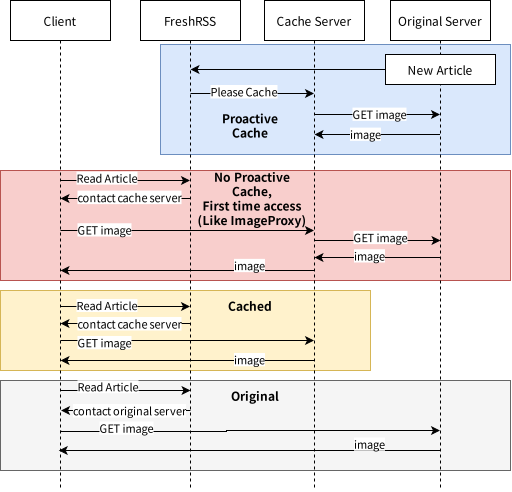

# Image Cache Extension for FreshRSS

This extension allows you to cache images from the feeds in FreshRSS. It helps speed up feed loading times and reduce bandwidth usage by caching images on a server.

## Installation

1. **Download and Setup**:
   - Download the zip file from the [Releases page](https://github.com/Victrid/freshrss-image-cache-plugin/releases).
   - Extract the folder and place it in the `extensions` directory of your FreshRSS installation, ensuring that the `metadata.json` file is in the root of the `imagecache` folder.
   - Enable the extension through the FreshRSS extension panel.

   After installation, your directory structure should resemble:

   ```
   extensions/
   |-- imagecache/
   |   |-- metadata.json
   |   |-- imagecache.php
   |   |-- ...
   |-- some-other-extension/
   |-- ...
   ```

## Usage

**Note**: This extension does not cache images directly within the FreshRSS instance. Instead, it works with an external cache service to store images.

### How It Works

The diagram below illustrates the extension's operation:



When proactive caching is enabled, FreshRSS sends a request to your cache service to store the image if a new feed entry includes image URLs. This modifies the image URL so users access the cached version instead of the original source.

### Setting Up a Cache Server

You have two options for setting up your cache server:

1. **Self-Hosted Server**:
   - Use the example provided in [piccache.php.example](piccache.php.example). Rename it to `piccache.php` and place it in your `/path/to/FreshRSS/p` directory.
   - Update the configuration in `piccache.php` as follows:

     ```php
     define("CACHE_PLACE_PATH", "/path/to/cache/folder");
     define("ACCESS_TOKEN", "SoMe_oBsCuRe_aCcEsS_ToKeN");
     ```

   - (For Docker users) You can build a custom image with the following Dockerfile:

     ```dockerfile
     FROM freshrss/freshrss:latest
     
     COPY piccache.php /var/www/FreshRSS/p/piccache.php
     ```

   - Configure FreshRSS to use the caching service:

     ```yaml
     Cache URL: "http://192.168.1.123:4567/piccache.php?url="
     Enable proactive cache: checked
     Proactive Cache URL: "http://192.168.1.123:4567/piccache.php"
     Access Token: "SoMe_oBsCuRe_aCcEsS_ToKeN"
     ```

   This script is basic and does not handle cleaning up old caches or implementing crawler-detection avoidance. If you need a reliable cache server, consider the cloudflare worker solution below.

2. **Cloudflare Worker**:
   - If you have limited bandwidth or experience high latency, consider using a [Cloudflare Worker](https://github.com/Victrid/image-cache-worker). This solution caches images on Cloudflare's CDN, which can be set up on their free tier without a custom domain.

## Additional Information

When proactive cache is enabled, the plugin sends a JSON POST request to the cache URL in the following format:

```json
{
    "url": "https://http.cat/418.jpg",
    "access_token": "YOUR_ACCESS_TOKEN"
}
```

## Alternatives

Consider the [ImageProxy](https://github.com/FreshRSS/Extensions/tree/master/xExtension-ImageProxy) plugin if you need a simpler solution for proxying images without caching.

## License

This extension is inspired by the ImageProxy plugin and is available under the GPLv3 license.
