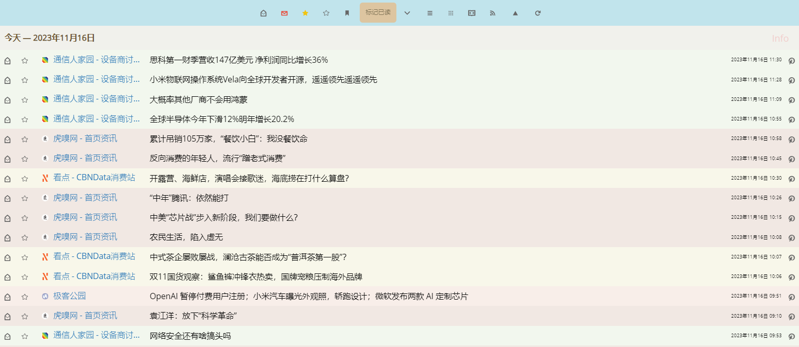

# FreshRSS Colorful List

Generate light different background color for article list rows (relying on the feed name)

## Installation

To use it, upload the *xExtension-ColorfulList* folder in your ./extensions directory and enable it on the extension panel in FreshRSS.

## Preview

