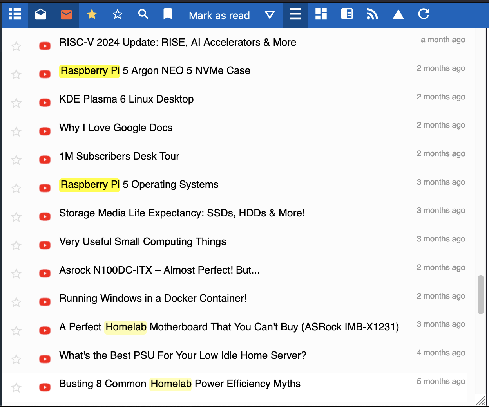
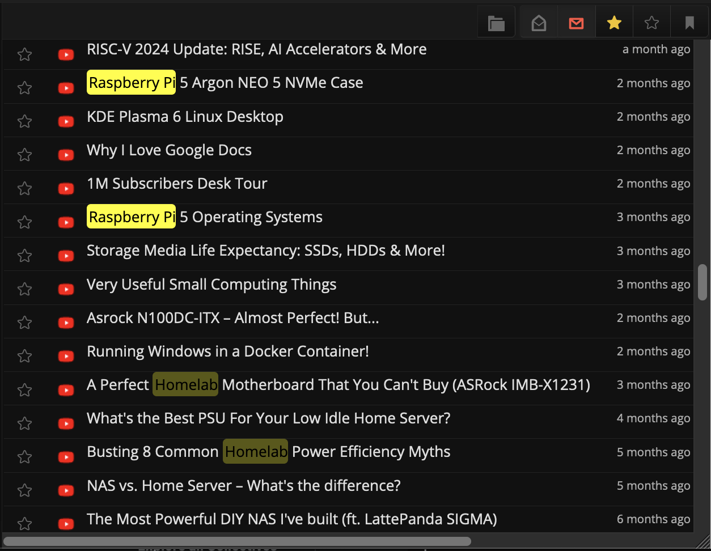

# WordHighlighter extension

A FreshRSS extension which give ability to highlight user-defined words.

## Usage

To use it, upload this directory in your `./extensions` directory and enable it on the extension panel in FreshRSS. You can add words to be highlighted by clicking on the manage button ⚙️.
See also official docs at freshrss.github.io/FreshRSS/en/admins/15_extensions.html

## Preview

Light theme:

<!-- markdownlint-disable -->

  
click to see example screenshot in dark theme

<!-- markdownlint-enable -->

## Changelog

- 0.0.2 use `json` for storing configuration, add more configuration options
  (enable_in_article, enable_logs, case_sensitive, separate_word_search)
  and refactored & simplified code
- 0.0.1 initial version (as a proper FreshRSS extension)
