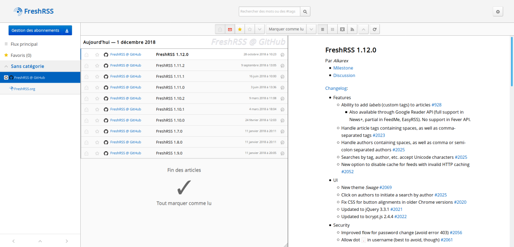

# ThreePanesView

Adds a third vertical pane along the articles list, to display the articles content

# Troubleshooting

## Failure to load website in third pane

ThreePanesView will try to open the websites links (from the planet icon) directly in the third pane, using an iframe. However, some websites prevent through their [CSP](https://developer.mozilla.org/en-US/docs/Web/HTTP/CSP). Unfortunately ThreePanesView has no proper to way to detect the loading failure.

In that case you'll have to use CTRL + click to open the website in a new tab.

## Display on small screens

On screens with a width above 840px and below ~1600px, the articles list might be too narrow and the articles titles will be truncated.
Each theme will have a different behaviour so it is hard for this extension to adapt.

You might want to consider hiding the left menu by default and enable it when needed with my other extension: [TogglableMenu](https://framagit.org/nicofrand/xextension-togglablemenu).

## Donate

If you like the work I am doing, consider making a donation!

