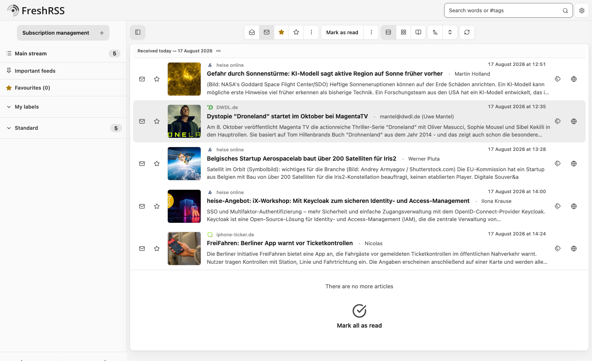

# Atelier

A calm light and dark theme for FreshRSS, inspired by [shadcn/ui](https://ui.shadcn.com/), on the Tailwind Neutral palette — grey without a hue — with a clear reading hierarchy, soft radii, and subtle motion.

## What it is

Atelier is derived from [Mapco](../Mapco/) and keeps its structural foundation; `atelier-ui.css` is the layer that gives the interface its own voice. It carries no web fonts and no scripts, and loads nothing from an external service while you read.

* **Light and dark.** The dark scheme follows the reader's system preference, gated on FreshRSS's own *Automatic dark mode* setting: every rule behind `prefers-color-scheme: dark` also asks for `darkMode_auto`, so a reader who turns that setting off keeps a light page.
* **Colors are roles, never literals.** `_variables.css` maps shadcn/ui's semantic roles — background, foreground, muted, border, accent, destructive — onto an eleven-step neutral ramp in `_palette.css`. Which step a role takes is decided by the contrast it needs, so the [CustomCSS extension](https://github.com/FreshRSS/Extensions) can move the whole interface by redefining the ramp.
* **Icons are local.** The bundled [Lucide](https://lucide.dev/) SVGs live in `icons/`. Most are painted as CSS masks rather than recolored with filters, which lets a glyph follow `currentColor` through hover, active and dark states.
* **Right to left.** Direction is answered inside the sheet: a declaration that reads differently in Arabic or Hebrew carries a `:dir(rtl)` rule beside it. The `*.rtl.css` mirrors are therefore copies, and each sheet is wrapped in rtlcss's ignore directives so `npm run rtlcss` writes them as such instead of reversing rules that are already mirrored.

## Requirements

A browser from 2024 or later: the theme uses nesting, `:has()`, subgrid, `color-mix()` and `:dir()`, which in practice means Chrome or Edge 120+, Firefox 121+, or Safari 17.2+.

## Other palettes

Atelier ships in eight further neutral ramps — Slate, Gray, Zinc, Stone, Taupe, Mauve, Mist and Olive — which are the same theme on a different grey. They live at [mbieh/Atelier](https://github.com/mbieh/Atelier), together with the source these folders are generated from.

## Credits

* Derived from the [Mapco](../Mapco/) theme by Thomas Guesnon and the FreshRSS project.
* Icons from [lucide-static](https://github.com/lucide-icons/lucide) 1.31.0, ISC licensed, some of them descended from [Feather](https://github.com/feathericons/feather) (MIT). Both notices are in [`icons/LICENSE`](./icons/LICENSE).
* Design and color references: [shadcn/ui](https://ui.shadcn.com/) and [Tailwind CSS](https://tailwindcss.com/).
